# Vinora — Product Requirements Document

**Version:** 1.0
**Status:** Approved for Development
**Document Owner:** Product Team
**Last Updated:** 2026-07-23

---

## 1. Executive Summary

Vinora is a personal finance management mobile application built to make everyday money-tracking calm, fast, and habit-forming rather than a chore reserved for month-end review. Where most personal finance apps compete on the volume of statistics they can generate, Vinora competes on restraint: a small, well-considered set of screens (Dashboard, Transactions, Categories, Savings Goals, Reports, Settings) that together answer the four questions a person actually asks about their money — *where did it come from, where did it go, am I on track, what should I do next* — without requiring financial literacy to interpret the answer.

This document specifies the first public release (V1) of Vinora as a production-ready consumer application: a React Native (Expo, TypeScript) mobile client backed by a Laravel REST API and MySQL database, targeting iOS first with an architecture that is Android-ready from day one. V1 ships single-user, single-base-currency, with offline-capable transaction entry and background sync. It explicitly excludes banking integrations, multi-user/family accounts, investment tracking, gamification, and any AI-assistant features — these exclusions are load-bearing product decisions, not gaps to be filled later.

This PRD is the single source of truth for product, design, engineering, and QA. Every requirement carries acceptance criteria; every entity, API, and screen traces back to a requirement; every risk carries a mitigation and an owner.

---

## 2. Business Background

Personal finance apps generally fall into one of two failure modes: they are either **spreadsheets with a UI** (powerful but cold, demanding financial fluency the average user doesn't have and doesn't want to develop), or **gamified habit-trackers** (approachable but untrustworthy — streaks and badges undermine the seriousness of the subject matter). Neither produces long-term daily use for the audience Vinora targets: students, young professionals, freelancers, and employees who want to understand their money without becoming amateur accountants.

Vinora's opportunity is the gap between these two poles — a product that treats personal finance with the calm authority of a well-designed tool while remaining approachable enough that a first-time user completes their first transaction entry in under a minute. The "why now" is straightforward: mobile-first financial habits (rather than desktop spreadsheets) are now the default expectation for this demographic, and the market's existing mobile options skew toward either bank-linked aggregators (which Vinora deliberately is not) or over-featured budgeting suites that reintroduce the complexity Vinora is designed to avoid.

## 3. Problem Statement

Individuals without a background in finance struggle to maintain a consistent, low-friction habit of tracking personal income and spending. Existing tools either demand too much manual categorization overhead, present too much undifferentiated data (charts and statistics with no interpretive layer), or require linking sensitive banking credentials that many users are unwilling to share with a third-party app. The result is that most people abandon finance tracking within weeks, defaulting back to either no tracking at all or fragmented tracking across notes apps and bank statements. Vinora solves this by making transaction entry fast enough to survive daily use, and by making the information architecture legible enough that users understand their financial position without needing to interpret it.

## 4. Goals & Objectives

**Product Goals**
- Make recording a transaction fast enough that it fits inside a 10-second "before I forget" moment (target: at most 3 taps from app open to saved transaction for a repeat category).
- Make the Dashboard answer "am I okay right now?" without requiring the user to open any other screen.
- Give users full ownership of how they organize their finances (no permanent built-in vs. custom category distinction) so the categorization scheme fits their life rather than a template.
- Make savings goals feel like visible progress rather than an abstract number.

**Business Goals**
- Establish Vinora as a trusted, daily-use personal finance habit for its target demographic, measured by retention rather than acquisition volume in V1.
- Ship a production-ready V1 (not a beta/MVP-feeling release) within the confirmed few-month timeline with a 2–5 person team, so scope discipline is treated as a first-class constraint, not an afterthought.
- Establish an architecture (data model, API, mobile app structure) that supports Android expansion and future feature phases without a rebuild.

## 5. Success Metrics & KPIs

Since Vinora V1 has no monetization (no subscription, no ads — explicitly out of scope), success is measured on engagement and product-quality signals rather than revenue:

| Metric | Target (90 days post-launch) | Why it matters |
|---|---|---|
| D7 retention (users who log at least 1 transaction 7 days after signup) | 35% or higher | Validates the "daily habit" thesis in the brief |
| Median transactions logged per active user per week | 5 or more | Signals the app is being used for real day-to-day tracking, not one-time setup |
| Time-to-first-transaction after signup | 2 minutes or less | Validates onboarding friction is low enough to survive first impressions |
| Crash-free session rate | 99.5% or higher | Non-functional quality bar for a mature, polished product |
| Savings goal creation rate (share of active users with at least 1 goal) | 25% or higher | Signals the savings-goal feature is discovered and used, not buried |
| App Store / Play Store rating | 4.5 or higher | Direct proxy for the brand promise of calm, trustworthy, dependable |
| Offline transaction entries later synced without conflict/error | 99% or higher | Validates the offline-mode NFR |

These are launch-window targets for a first release with modest initial user counts (see the Non-Functional Requirements section for the underlying scale assumptions); they should be revisited after real usage data is available.

## 6. Stakeholders

| Role | Responsibility |
|---|---|
| Product Owner | Owns scope discipline against the brief's Out of Scope list; final arbiter on feature prioritization |
| Product Designer / UX | Owns the design system (Vinora's own brand tokens), screen inventory, and interaction states |
| Mobile Engineers (React Native/Expo) | Build and maintain the client app, including offline-sync logic |
| Backend Engineers (Laravel) | Build and maintain the REST API, business logic, database, and background jobs |
| QA / Test Engineer | Owns the test strategy, test case authoring, and release sign-off |
| DevOps | Owns VPS deployment, CI/CD, monitoring, and backup strategy |
| End Users | Individuals managing personal finances — the sole user role in V1 (no admin/internal-facing role exists) |

---

## 7. Product Vision

Vinora exists to make financial awareness effortless. Rather than asking users to become analysts of their own spending, Vinora surfaces the right information at the right time — a balance that's always current, a category breakdown that explains itself at a glance, a savings goal that visibly moves — so that understanding one's finances becomes a natural byproduct of using the app for thirty seconds a day, not a deliberate analytical exercise undertaken once a month.

---

## 8. Product Scope

### 8.1 In Scope (V1)

- Email/password authentication (signup, login, logout, password reset, profile management)
- Dashboard: current balance, income/expense totals, monthly summary, recent transactions, savings goal progress, quick actions
- Transaction CRUD: income and expense types, with title, amount, category, optional note, date, optional attachment (upload capability implemented; UI entry point may be minimal per the brief's future-ready, implementation-optional guidance)
- Category management: create, rename, delete, reorder; no permanent built-in/custom distinction after onboarding
- Savings goals: create, edit, contribute, track progress, optional deadline and description
- Reports: monthly summaries, category distribution, income vs. expense, spending trends
- Search and filtering across transactions (title, category, date, type)
- Settings: profile, base currency selection, notification preferences, appearance (light/dark), security (password change, session management)
- Offline mode: view cached data and create/edit transactions without connectivity; background sync with conflict resolution on reconnect
- Cross-platform-ready architecture (iOS-first UI/QA target, Android-compatible data layer and API from day one)

### 8.2 Out of Scope

Per the brief's explicit constraints, none of the following are part of V1 and should not be reintroduced without a deliberate future product-planning decision:

Banking/Open Banking integration, credit card synchronization, cryptocurrency management, stock/investment portfolio tracking, loan management, tax calculation, invoice generation, business/team accounting, family or multi-user finance management, marketplace features, social features, AI financial assistant or chatbot, AI spending recommendations, gamification/rewards systems, premium subscriptions, and advertising.

Also out of scope for V1 specifically (may be reconsidered in future phases, see Future Enhancements): multi-language localization, Android app store submission (architecture supports it; V1 ship target is iOS), and automatic currency conversion.

---

## 9. Assumptions & Constraints

**Assumptions** (defaulted where discovery left them open, stated explicitly rather than left implicit):
- UI ships in English only for V1; no localization/i18n user-facing strings work beyond structuring the codebase so translation is not architecturally blocked later.
- Push notifications use a standard managed provider (Expo push notification service, given the Expo-based client) for goal milestones and optional reminders — no custom push infrastructure.
- Crash reporting and basic product analytics use a single lightweight, privacy-respecting SDK (recommended: Sentry for crash/error reporting; no separate marketing analytics SDK given no advertising/growth-marketing scope in V1).
- Accessibility target is WCAG 2.1 AA, consistent with the brief's accessibility principles, though Vinora is not subject to a formal legal accessibility mandate.
- No named regulatory compliance regime applies (Vinora is not a bank, payment processor, or investment platform), but standard data-protection practice (encryption at rest and in transit, secure password storage, session management) is treated as a non-negotiable baseline regardless.

**Constraints:**
- Team size: 2–5 people for the initial build.
- Timeline: a few months to V1 launch — this shapes nearly every scope decision below (no queueing infrastructure, no microservices, no multi-region deployment).
- Single base currency per user; no automatic currency conversion (brief-mandated).
- Single-user accounts only; no collaborative/family/shared-wallet features (brief-mandated).
- Deployment target: a single Linux VPS (Ubuntu + Nginx + PHP-FPM + MySQL) rather than managed cloud services, kept cloud-agnostic so migration to DigitalOcean, Hetzner, AWS, or GCP requires no architectural change.

---

## 10. User Personas

**Persona 1 — "The Starter" (university student)**
- Context: First time managing money independently (allowance, part-time income, irregular small expenses). Low financial literacy, high price sensitivity, heavy phone usage.
- Goals: Avoid running out of money before the month ends; understand where small daily spending (food, transport) actually goes.
- Frustrations with existing tools: Budgeting apps that assume salaried income and recurring bills; anything requiring bank-account linking (distrust, no compatible local bank support).
- What Vinora gives them: Fast manual entry, flexible categories that match irregular spending patterns, a dashboard that doesn't require financial vocabulary.

**Persona 2 — "The Builder" (young professional / employee)**
- Context: Salaried income, recurring fixed expenses (rent, subscriptions), starting to think about savings goals (emergency fund, a trip, a purchase).
- Goals: Build a consistent tracking habit; make visible progress on 1–2 savings goals; understand monthly spending trend without doing manual spreadsheet work.
- Frustrations with existing tools: Apps that require constant manual categorization overhead or bury savings goals behind a paywall.
- What Vinora gives them: A monthly summary and trend reports that reveal patterns; visual, motivating savings goal tracking without gamification gimmicks.

**Persona 3 — "The Independent" (freelancer / small business owner tracking personal expenses separately)**
- Context: Irregular, multi-source income; needs a strict separation between personal and business finances (Vinora is explicitly personal-only, which this persona values as a boundary, not a limitation).
- Goals: Track personal income/expenses cleanly, separate from whatever business tool they already use; keep a personal savings goal moving despite income variability.
- Frustrations with existing tools: All-in-one finance suites that push accounting/invoicing features they don't want mixed with personal tracking.
- What Vinora gives them: A dedicated personal-only surface with custom categories flexible enough for irregular income sources, and zero business-accounting feature creep.

## 11. Empathy Map

| | Starter | Builder | Independent |
|---|---|---|---|
| **Thinks** | "I don't want to do math, I just want to know if I can afford lunch." | "I know I should track this, I just don't have time to do it properly." | "I already have a system for my business — I need something separate and simple for me." |
| **Feels** | Anxious about running out of money unexpectedly | Mildly guilty about inconsistent tracking habits | Protective of the personal/business boundary |
| **Sees** | Friends using budgeting apps that feel too "adult" or complex | Ads for finance apps promising automation they don't trust | Business tools that don't fit personal use at all |
| **Says/Does** | Tracks sporadically in notes apps, gives up after a week | Starts strong, abandons tracking mid-month when it gets tedious | Keeps mental tally, rarely writes anything down |

## 12. Jobs To Be Done

- **JTBD-1:** When I spend or receive money, I want to log it in a few seconds, so that I don't lose track of it before I forget.
- **JTBD-2:** When I open the app, I want to immediately see if I'm financially okay right now, so that I don't have to calculate it myself.
- **JTBD-3:** When I want to organize my spending my way, I want full control over categories, so that the app fits my life instead of a generic template.
- **JTBD-4:** When I'm saving for something specific, I want to see visible progress toward it, so that I stay motivated without needing external rewards or streaks.
- **JTBD-5:** When I want to understand a spending pattern (e.g., "did I spend more on food this month?"), I want a clear report, so that I can make a decision without interpreting raw numbers myself.
- **JTBD-6:** When I don't have signal (subway, flight, rural area), I still want to log a transaction, so that I don't lose the habit or forget the details later.

## 13. User Journey

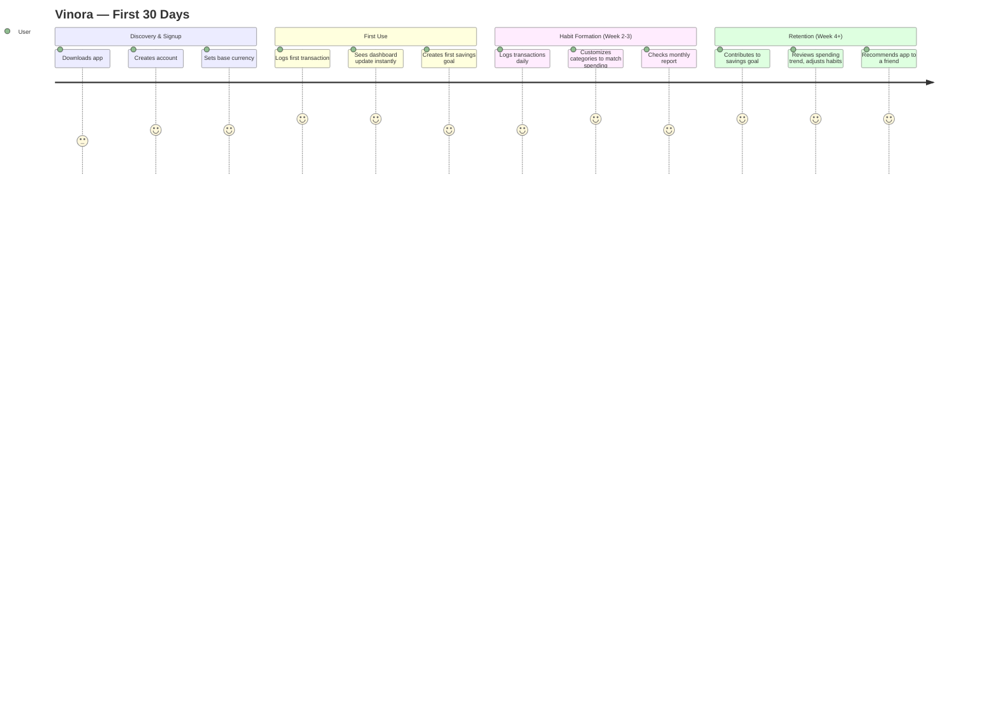

---

## 14. User Flows

### 14.1 Onboarding & First Transaction (maps to FR-001–FR-004, FR-010)

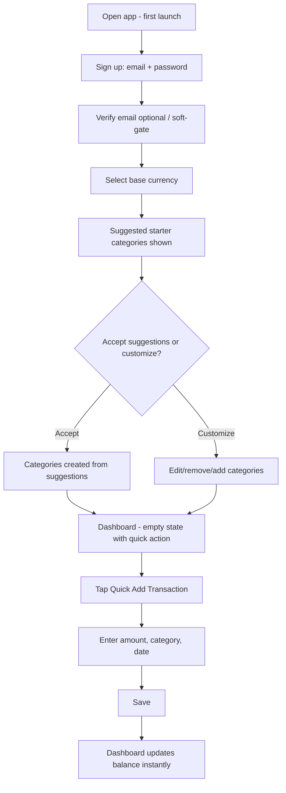

### 14.2 Recording a Transaction, Online or Offline (maps to FR-010–FR-014, FR-040–FR-042)

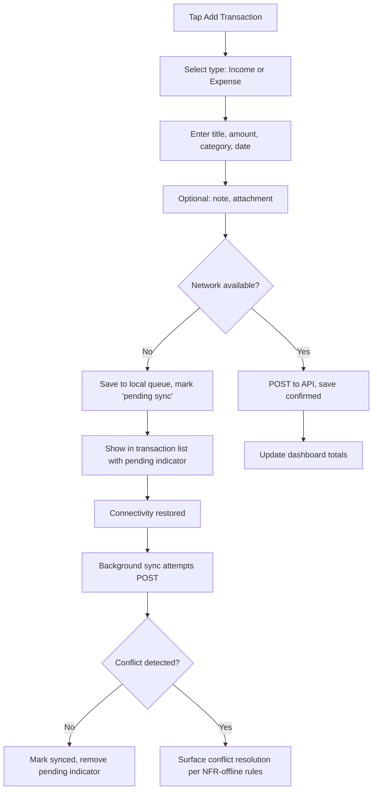

### 14.3 Savings Goal Contribution (maps to FR-020–FR-024)

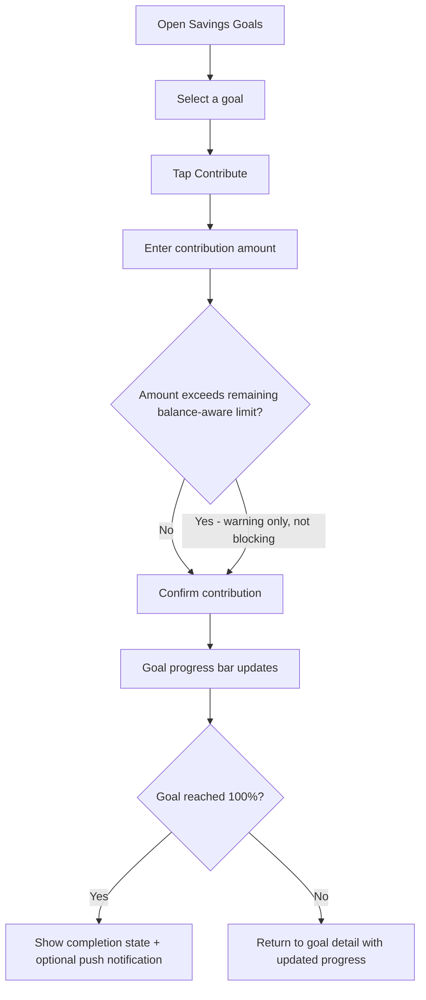

### 14.4 Category Management (maps to FR-030–FR-034)

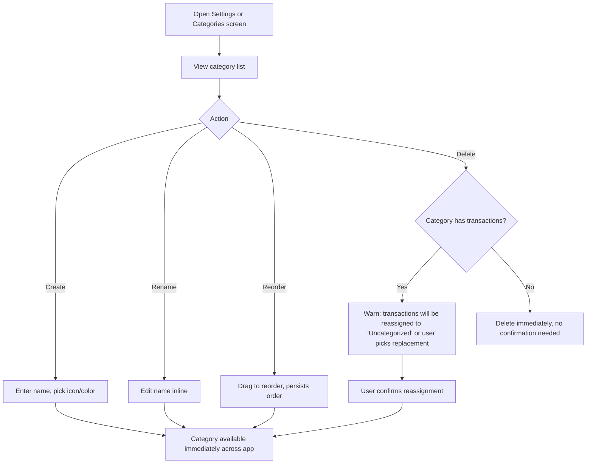

### 14.5 Report Review (maps to FR-050–FR-053)

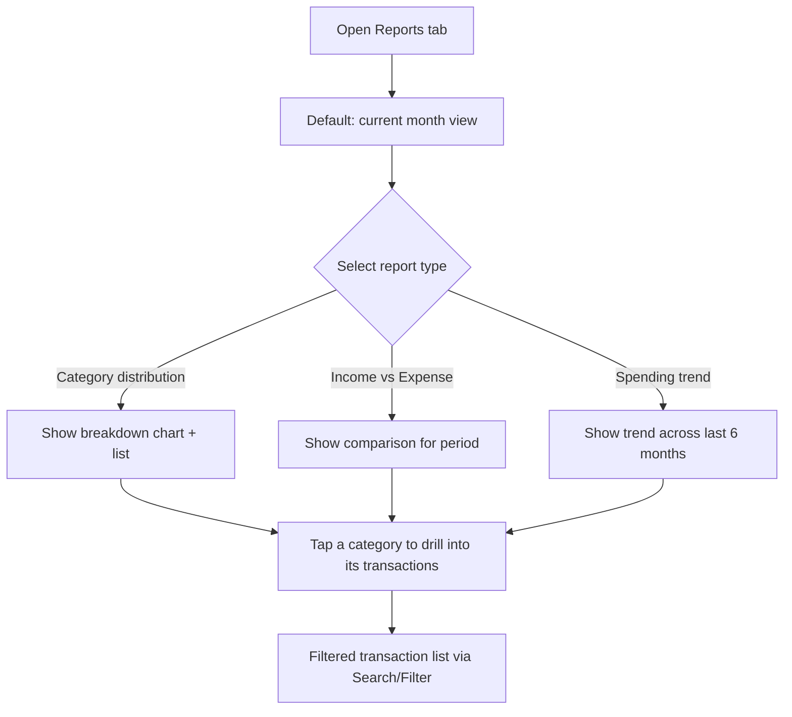

## 15. Information Architecture & Sitemap

```mermaid
graph TD
    Root[Vinora App] --> Auth[Auth]
    Auth --> A1[Sign Up]
    Auth --> A2[Log In]
    Auth --> A3[Forgot Password]

    Root --> Tabs[Main Tab Navigation]

    Tabs --> Dash[Dashboard]
    Dash --> D1[Balance + Monthly Summary]
    Dash --> D2[Recent Transactions]
    Dash --> D3[Savings Goal Progress Widget]
    Dash --> D4[Quick Actions: Add Income / Add Expense]

    Tabs --> Txn[Transactions]
    Txn --> T1[Transaction List]
    Txn --> T2[Search & Filter]
    Txn --> T3[Transaction Detail]
    Txn --> T4[Add/Edit Transaction]

    Tabs --> Goals[Savings Goals]
    Goals --> G1[Goal List]
    Goals --> G2[Goal Detail + Contribution History]
    Goals --> G3[Add/Edit Goal]

    Tabs --> Rep[Reports]
    Rep --> R1[Monthly Summary]
    Rep --> R2[Category Distribution]
    Rep --> R3[Income vs Expense]
    Rep --> R4[Spending Trend]

    Tabs --> Set[Settings]
    Set --> S1[Profile]
    Set --> S2[Categories Management]
    Set --> S3[Base Currency]
    Set --> S4[Notifications]
    Set --> S5[Appearance]
    Set --> S6[Security - Password, Sessions]
```

---

## 16. Functional Requirements

### 16.1 Authentication & Profile

**FR-001** — Account Registration
- **Description:** Users can create an account with email and password.
- **Priority:** Must
- **Business Value:** Gateway to all product usage; must be low-friction to protect the time-to-first-transaction success metric.
- **User Story:** As a new user, I want to create an account with my email and a password, so that I can start tracking my finances.
- **Acceptance Criteria:**
  - Given a valid, unused email and a password meeting complexity rules (min. 8 characters, at least 1 letter and 1 number), when the user submits signup, then an account is created and the user is authenticated and redirected to currency selection.
  - Given an email already registered, when the user submits signup, then a clear error is shown without confirming whether the account exists for a different reason (to avoid account enumeration — see Security).
  - Given a password failing complexity rules, when the user submits, then a specific inline validation message explains the unmet rule.
- **Dependencies:** ENT-User
- **Edge Cases:** Duplicate submission (double-tap) must not create two accounts; network failure mid-submission must not leave the user in an ambiguous state (show retry, don't silently fail).
- **Risks:** Weak passwords if complexity rules are too lax.
- **Notes:** Email verification is soft-gated (see FR-002) — it does not block core app usage in V1.

**FR-002** — Email Verification (soft gate)
- **Description:** After signup, a verification email is sent; unverified accounts can use the app fully but see a persistent, dismissible reminder banner.
- **Priority:** Should
- **Business Value:** Reduces signup friction (hard email verification gates measurably hurt time-to-first-transaction) while still encouraging verified accounts for password-reset reliability.
- **User Story:** As a new user, I want to start using the app immediately after signup, so that I don't lose momentum waiting on an email.
- **Acceptance Criteria:**
  - Given a new unverified account, when the user completes signup, then they land on currency selection without waiting for email confirmation.
  - Given an unverified account, when the user opens the app, then a dismissible banner prompts verification, reappearing after 7 days if dismissed and still unverified.
- **Dependencies:** FR-001
- **Edge Cases:** Verification link expiry (24h) requires a resend option.
- **Risks:** Users who never verify cannot recover a forgotten password via email — mitigated by requiring verification before password-reset requests are honored (see FR-004).
- **Notes:** None.

**FR-003** — Login / Logout
- **Description:** Registered users can log in and out; sessions are managed via Laravel Sanctum tokens.
- **Priority:** Must
- **Business Value:** Core access control.
- **User Story:** As a returning user, I want to log in with my credentials, so that I can access my data securely.
- **Acceptance Criteria:**
  - Given valid credentials, when the user logs in, then a Sanctum token is issued and the app persists it securely on-device (see Security).
  - Given invalid credentials, when the user attempts login, then a generic "email or password incorrect" error is shown (no distinction between wrong email vs. wrong password, to prevent enumeration).
  - Given a logged-in user, when they tap Log Out, then the current device's token is revoked and local cached data is cleared per the data-retention rule in Settings.
- **Dependencies:** ENT-User, API-002, API-003
- **Edge Cases:** Login attempted while offline shows a clear "no connection" state rather than a generic error; repeated failed attempts trigger rate limiting (see NFR-Security).
- **Risks:** Brute-force login attempts — mitigated by rate limiting.
- **Notes:** None.

**FR-004** — Password Reset
- **Description:** Verified users can request a password reset via email.
- **Priority:** Must
- **Business Value:** Prevents permanent account lockout, a top driver of support burden and churn.
- **User Story:** As a user who forgot my password, I want to reset it via email, so that I can regain access without losing my data.
- **Acceptance Criteria:**
  - Given a verified account, when the user requests a reset, then a time-limited (1 hour) reset link is emailed.
  - Given an unverified account, when the user requests a reset, then the system informs them verification is required first and offers to resend the verification email.
  - Given an expired or already-used reset link, when the user opens it, then a clear message explains the link is invalid and offers to request a new one.
- **Dependencies:** FR-002
- **Edge Cases:** Multiple concurrent reset requests must invalidate earlier unused tokens.
- **Risks:** None beyond standard token-based reset risk, mitigated by short expiry.
- **Notes:** None.

**FR-005** — Profile Management
- **Description:** Users can view and edit their name, email, and profile photo.
- **Priority:** Should
- **Business Value:** Basic personalization expected of any modern app; low effort, meaningful trust signal.
- **User Story:** As a user, I want to update my profile information, so that my account reflects who I am.
- **Acceptance Criteria:**
  - Given the profile screen, when the user edits their name and saves, then the change is persisted and reflected immediately.
  - Given the user changes their email, when they submit, then the new email must be re-verified before it becomes the primary login email (old email remains active until then).
- **Dependencies:** FR-002
- **Edge Cases:** Changing to an email already in use by another account is rejected.
- **Risks:** None significant.
- **Notes:** None.

### 16.2 Dashboard

**FR-010** — Dashboard Overview
- **Description:** The dashboard displays current balance, total income, total expenses, monthly summary, recent transactions, savings goal progress, and quick actions, all as of the current data state.
- **Priority:** Must
- **Business Value:** This is the single screen that fulfills the brief's "communicate financial condition without requiring interpretation" mandate — the highest-value screen in the product.
- **User Story:** As a user, I want to see my financial condition the moment I open the app, so that I don't need to calculate or interpret anything myself.
- **Acceptance Criteria:**
  - Given at least one transaction exists, when the user opens the dashboard, then current balance, this month's income, this month's expenses, and up to 5 recent transactions are shown, all reflecting data as of the last successful sync.
  - Given no transactions exist yet, when the user opens the dashboard, then an empty state explains what the dashboard will show and prompts a first transaction (see UX Section 8, empty states).
  - Given the user has at least one active savings goal, when the dashboard loads, then the goal with the nearest deadline (or most recent activity if no deadline) is shown with a progress indicator.
- **Dependencies:** FR-011–FR-014, FR-020
- **Edge Cases:** Data still syncing (offline-created transactions pending) shows a subtle "updating" indicator rather than a stale, confident-looking number.
- **Risks:** Overloading the dashboard with too many widgets contradicts the brief's "prioritize clarity over excessive statistics" principle — scope is deliberately capped at the 7 elements listed in the brief.
- **Notes:** None.

**FR-011** — Quick Actions
- **Description:** Dashboard surfaces one-tap entry points for "Add Income" and "Add Expense."
- **Priority:** Must
- **Business Value:** Directly supports the "≤3 taps to log a transaction" product goal.
- **User Story:** As a user, I want to add a transaction directly from the dashboard, so that logging money takes as few steps as possible.
- **Acceptance Criteria:**
  - Given the dashboard is open, when the user taps "Add Expense" or "Add Income," then the transaction entry form opens pre-filled with that type selected.
- **Dependencies:** FR-012
- **Edge Cases:** None beyond standard form edge cases (see FR-012).
- **Risks:** None significant.
- **Notes:** None.

### 16.3 Transaction Management

**FR-012** — Create Transaction
- **Description:** Users can record an income or expense transaction with title, amount, category, date, optional note, and optional attachment.
- **Priority:** Must
- **Business Value:** Core product function; every other feature (dashboard, reports, search) depends on transaction data existing.
- **User Story:** As a user, I want to record a transaction in a few taps, so that I never lose track of my spending or income.
- **Acceptance Criteria:**
  - Given the transaction form, when the user enters a positive amount, selects a type (income/expense) and a category, and saves, then the transaction is created with the current date pre-filled (editable) and appears immediately in the transaction list and dashboard totals.
  - Given the user does not select a category, when they attempt to save, then category is required and a validation message is shown (category is mandatory; note and attachment are optional).
  - Given the user attaches a file (future-ready capability), when they save, then the attachment uploads asynchronously without blocking the transaction save.
- **Dependencies:** ENT-Transaction, ENT-Category, API-010
- **Edge Cases:** Zero or negative amount is rejected with inline validation; extremely large amounts (see NFR data limits) are capped to prevent overflow/display issues; offline creation queues locally (see FR-040).
- **Risks:** None beyond standard input validation.
- **Notes:** Attachment upload UI may ship minimal (e.g., a single "attach receipt" button) per the brief's "implementation optional" note — the API and data model fully support it regardless.

**FR-013** — Edit Transaction
- **Description:** Users can edit any field of an existing transaction.
- **Priority:** Must
- **Business Value:** Mistakes and forgotten details are inevitable in fast manual entry; editing must be as frictionless as creation.
- **User Story:** As a user, I want to correct a transaction I entered incorrectly, so that my records stay accurate.
- **Acceptance Criteria:**
  - Given an existing transaction, when the user edits any field and saves, then the change is persisted and all dependent views (dashboard, reports) reflect it immediately.
  - Given the category of a transaction is deleted after the transaction was created, when the user views/edits it, then the transaction shows "Uncategorized" until reassigned.
- **Dependencies:** FR-012
- **Edge Cases:** Editing a transaction that is still pending offline sync updates the queued local copy, not a server copy.
- **Risks:** None significant.
- **Notes:** None.

**FR-014** — Delete Transaction
- **Description:** Users can delete a transaction with a confirmation step.
- **Priority:** Must
- **Business Value:** Data hygiene; supports correcting mistakes.
- **User Story:** As a user, I want to delete a transaction I entered by mistake, so that my totals stay accurate.
- **Acceptance Criteria:**
  - Given a transaction, when the user taps delete, then a confirmation dialog appears (deletion is destructive and irreversible, warranting confirmation per UX principles).
  - Given confirmed deletion, when processed, then the transaction is removed and dashboard/report totals update immediately.
- **Dependencies:** FR-012
- **Edge Cases:** Deleting a transaction that is still pending offline sync simply removes it from the local queue without a server call.
- **Risks:** Accidental deletion — mitigated by the confirmation dialog.
- **Notes:** None.

### 16.4 Category Management

**FR-030** — Create Category
- **Description:** Users can create custom categories with a name, icon, and color.
- **Priority:** Must
- **Business Value:** Directly supports the brief's mandate that users remain in complete control of how they organize finances.
- **User Story:** As a user, I want to create a category that matches how I actually spend, so that my tracking reflects my real life.
- **Acceptance Criteria:**
  - Given the category management screen, when the user creates a category with a unique (per-user) name, then it becomes immediately available in the transaction form.
  - Given a duplicate category name (case-insensitive, per user), when the user attempts to create it, then a validation message prevents duplication.
- **Dependencies:** ENT-Category
- **Edge Cases:** Empty name is rejected.
- **Risks:** None significant.
- **Notes:** None.

**FR-031** — Suggested Starter Categories
- **Description:** During onboarding, the app suggests a small set of common categories (e.g., Food, Transport, Housing, Salary, Entertainment) the user can accept, edit, or ignore.
- **Priority:** Should
- **Business Value:** Reduces the "blank slate" problem for new users while preserving full user control (brief: no permanent built-in vs. custom distinction).
- **User Story:** As a new user, I want a starting set of categories, so that I can log my first transaction without first designing a whole category system.
- **Acceptance Criteria:**
  - Given onboarding, when the user reaches category setup, then 6–8 suggested categories are shown, pre-selected, editable before confirming.
  - Given the categories are created, when the onboarding completes, then they behave identically to any user-created category (fully rename/delete/reorder-able) — no internal "system category" flag is exposed or enforced after creation.
- **Dependencies:** FR-030
- **Edge Cases:** User deselects all suggestions — allowed; they proceed with zero categories and must create one before their first transaction.
- **Risks:** None significant.
- **Notes:** None.

**FR-032** — Rename / Delete / Reorder Category
- **Description:** Users can rename, delete, and reorder any category at any time.
- **Priority:** Must
- **Business Value:** Categorization schemes evolve as a user's life changes; locking this down would violate the brief's core philosophy.
- **User Story:** As a user, I want to rename or reorganize my categories as my spending habits change, so that my finance tracking stays relevant over time.
- **Acceptance Criteria:**
  - Given a category, when the user renames it, then all existing transactions referencing it show the new name (categories are referenced by ID, not by name string).
  - Given a category with existing transactions, when the user deletes it, then the user is prompted to reassign those transactions to another category or to "Uncategorized" before deletion completes.
  - Given the category list, when the user drags to reorder, then the new order persists and is reflected everywhere categories are listed (transaction form, filters, reports).
- **Dependencies:** FR-030, ENT-Transaction
- **Edge Cases:** Deleting the last remaining category while transactions reference it forces reassignment to "Uncategorized" (a permanent, non-deletable system bucket — the one deliberate exception to "no built-in categories," needed so no transaction is ever left orphaned).
- **Risks:** Data integrity risk if reassignment is skipped — mitigated by making reassignment a required step of the delete flow, not optional.
- **Notes:** None.

### 16.5 Savings Goals

**FR-020** — Create Savings Goal
- **Description:** Users can create a savings goal with title, target amount, optional deadline, and optional description.
- **Priority:** Must
- **Business Value:** Turns saving from an abstract intention into a trackable object — a core brand differentiator per the brief.
- **User Story:** As a user, I want to set up a savings goal, so that I have something concrete to work toward.
- **Acceptance Criteria:**
  - Given the goal creation form, when the user enters a title and a positive target amount, then the goal is created with progress starting at zero.
  - Given an optional deadline is set in the past, when the user attempts to save, then a validation message prevents it.
- **Dependencies:** ENT-SavingsGoal
- **Edge Cases:** None beyond standard validation.
- **Risks:** None significant.
- **Notes:** None.

**FR-021** — Contribute to Goal
- **Description:** Users can add a contribution amount toward an existing goal at any time.
- **Priority:** Must
- **Business Value:** The core interaction that makes progress visible and motivating.
- **User Story:** As a user, I want to log money I've set aside toward a goal, so that I can see my progress grow.
- **Acceptance Criteria:**
  - Given an active goal, when the user contributes a positive amount, then the goal's current progress increases and the progress bar updates immediately.
  - Given a contribution that brings progress to or above the target amount, when saved, then the goal is marked complete and a celebratory (non-gamified, per brand personality — see Section 10 of the brief excluding "gamified") completion state is shown.
- **Dependencies:** FR-020, ENT-GoalContribution
- **Edge Cases:** Contribution amount is not validated against the user's actual balance (Vinora does not enforce fund availability — it is a tracking tool, not a transactional ledger with fund custody); this is a deliberate design decision to avoid overreach into behaviors resembling banking software.
- **Risks:** Users may perceive contributions as literally moving money (they do not — Vinora holds no funds). Mitigated by clear copy: "Log a contribution" rather than "Transfer."
- **Notes:** A contribution optionally auto-creates a linked expense transaction categorized as "Savings" if the user opts in, keeping the dashboard balance consistent; this is a Should-priority convenience, not required for V1 sign-off.

**FR-022** — Edit / Delete Goal
- **Description:** Users can edit a goal's details or delete it entirely.
- **Priority:** Should
- **Business Value:** Goals change (target amount adjustments, deadline shifts, abandoned plans).
- **User Story:** As a user, I want to adjust or remove a savings goal, so that it reflects my current plans.
- **Acceptance Criteria:**
  - Given an existing goal, when the user edits target amount or deadline, then the progress percentage recalculates against the new target.
  - Given the user deletes a goal, when confirmed, then the goal and its contribution history are removed (contribution history is not needed elsewhere since contributions are not separate ledger transactions by default).
- **Dependencies:** FR-020
- **Edge Cases:** Deleting a goal with an auto-linked "Savings" category transaction history (see FR-021 note) does not delete those transactions — only the goal object itself.
- **Risks:** None significant.
- **Notes:** None.

### 16.6 Reports

**FR-050** — Monthly Summary Report
- **Description:** A report view summarizing total income, total expenses, and net for a selected month.
- **Priority:** Must
- **Business Value:** Directly supports "understand spending behavior" per the brief.
- **User Story:** As a user, I want to see a summary of my month, so that I understand my overall financial pattern without manual calculation.
- **Acceptance Criteria:**
  - Given a selected month, when the report loads, then total income, total expenses, and net (income minus expenses) for that month are shown.
  - Given a month with no transactions, when selected, then a clear empty state is shown rather than a zeroed, confusing chart.
- **Dependencies:** ENT-Transaction
- **Edge Cases:** Partial current month (in progress) is clearly labeled as "month to date," not implied to be a complete month.
- **Risks:** None significant.
- **Notes:** None.

**FR-051** — Category Distribution Report
- **Description:** A breakdown of spending (and optionally income) by category for a selected period, shown as a chart plus a scannable list.
- **Priority:** Must
- **Business Value:** The single most requested insight in personal finance apps — "where did my money go."
- **User Story:** As a user, I want to see which categories consume most of my spending, so that I can identify where to adjust habits.
- **Acceptance Criteria:**
  - Given a selected period, when the report loads, then each category with at least one transaction shows its total and percentage share, sorted descending by amount.
  - Given the user taps a category in the report, then they are taken to a filtered transaction list for that category and period.
- **Dependencies:** FR-050, FR-060 (search/filter)
- **Edge Cases:** Categories with negligible amounts (below a small threshold) may be grouped into "Other" if the list would otherwise be too long to scan — threshold and grouping is a design-system decision, not hard-coded here.
- **Risks:** Overly complex charts contradict brief's "avoid complex financial charts" principle — chart type is capped at a simple donut/bar, no stacked/multi-axis charts.
- **Notes:** None.

**FR-052** — Income vs. Expense Report
- **Description:** A period-over-period comparison of total income against total expenses.
- **Priority:** Should
- **Business Value:** Answers "am I living within my means" at a glance.
- **User Story:** As a user, I want to compare my income and expenses over time, so that I can see if I'm consistently spending more than I earn.
- **Acceptance Criteria:**
  - Given a selected date range, when the report loads, then income and expense totals are shown side by side per period (e.g., per month) as a simple comparative chart.
- **Dependencies:** FR-050
- **Edge Cases:** None beyond standard empty-state handling.
- **Risks:** None significant.
- **Notes:** None.

**FR-053** — Spending Trend Report
- **Description:** A trend line of total spending across the last 6 months.
- **Priority:** Should
- **Business Value:** Reveals gradual habit shifts a single-month view can't show.
- **User Story:** As a user, I want to see how my spending has trended over recent months, so that I can notice patterns before they become problems.
- **Acceptance Criteria:**
  - Given at least 2 months of transaction history, when the trend report loads, then a simple line chart shows monthly totals across up to the last 6 months.
  - Given less than 2 months of history, when viewed, then an empty/insufficient-data state explains more history is needed.
- **Dependencies:** FR-050
- **Edge Cases:** None beyond standard empty-state handling.
- **Risks:** None significant.
- **Notes:** None.

### 16.7 Search & Filtering

**FR-060** — Search Transactions
- **Description:** Users can search transactions by title text.
- **Priority:** Must
- **Business Value:** Fast retrieval of a specific past transaction is a top usability need once transaction volume grows.
- **User Story:** As a user, I want to find a specific transaction by name, so that I don't have to scroll through my whole history.
- **Acceptance Criteria:**
  - Given a search term, when entered, then matching transactions (title contains term, case-insensitive) are shown, updating as the user types (debounced).
- **Dependencies:** ENT-Transaction
- **Edge Cases:** Empty search returns full (filtered, if filters applied) list.
- **Risks:** None significant.
- **Notes:** None.

**FR-061** — Filter Transactions
- **Description:** Users can filter the transaction list by category, date range, and transaction type (income/expense).
- **Priority:** Must
- **Business Value:** Complements search for structured narrowing (e.g., "all expenses in Food category last month").
- **User Story:** As a user, I want to filter my transactions by category, date, or type, so that I can quickly analyze a specific slice of my finances.
- **Acceptance Criteria:**
  - Given one or more filters applied, when active, then the transaction list and any visible totals update to reflect only matching transactions.
  - Given filters and a search term both active, when combined, then results satisfy both (AND logic).
- **Dependencies:** FR-060
- **Edge Cases:** No results matching filters shows a clear empty state with a "clear filters" action.
- **Risks:** Overwhelming filter UI contradicts brief's "intuitive without excessive options" principle — filter set is deliberately capped at the four dimensions named in the brief (title via search, category, date, type).
- **Notes:** None.

### 16.8 Settings

**FR-070** — Base Currency Selection
- **Description:** Users select one base currency during onboarding; it can be changed later, affecting future transactions only.
- **Priority:** Must
- **Business Value:** Brief-mandated single-currency constraint; must be explicit to avoid user confusion about historical values.
- **User Story:** As a user, I want to set my currency, so that all my amounts display correctly.
- **Acceptance Criteria:**
  - Given onboarding, when the user selects a currency, then it is stored as their base currency and used for all subsequent display and entry.
  - Given an existing user changes their base currency in Settings, when confirmed, then a clear warning explains that past transaction amounts are not converted — they remain recorded in their original numeric value, now displayed under the new currency symbol/format.
- **Dependencies:** ENT-User
- **Edge Cases:** None beyond the warning above (no automatic conversion, per brief-mandated constraint).
- **Risks:** User confusion about historical values under a new currency label — mitigated by the explicit warning copy required above.
- **Notes:** None.

**FR-071** — Notification Preferences
- **Description:** Users can enable/disable push notifications for goal milestones and optional daily/weekly reminders to log transactions.
- **Priority:** Should
- **Business Value:** Supports habit formation (the product's central thesis) without becoming intrusive or gamified.
- **User Story:** As a user, I want to control which notifications I receive, so that the app respects my attention.
- **Acceptance Criteria:**
  - Given the notification settings screen, when the user toggles a notification type off, then no further notifications of that type are sent.
  - Given a goal reaches 100% (FR-021), when notifications are enabled, then a single milestone notification is sent (not repeated).
- **Dependencies:** FR-021
- **Edge Cases:** OS-level notification permission denial is detected and reflected in-app (toggle shows disabled with a link to OS settings) rather than silently failing.
- **Risks:** None significant.
- **Notes:** None.

**FR-072** — Appearance (Light/Dark)
- **Description:** Users can select light, dark, or system-matched appearance.
- **Priority:** Could
- **Business Value:** Expected baseline for a "premium, modern" consumer app per the brief's design direction.
- **User Story:** As a user, I want to choose my app's appearance, so that it matches my preference and reduces eye strain at night.
- **Acceptance Criteria:**
  - Given the appearance setting, when changed, then the whole app updates immediately without requiring a restart.
- **Dependencies:** None
- **Edge Cases:** None significant.
- **Risks:** None significant.
- **Notes:** None.

**FR-073** — Security Settings
- **Description:** Users can change their password and view/revoke active sessions (devices).
- **Priority:** Must
- **Business Value:** Baseline trust requirement for any app handling personal financial data.
- **User Story:** As a user, I want to manage my account's security, so that I feel confident my financial data is protected.
- **Acceptance Criteria:**
  - Given the security screen, when the user changes their password (current password required), then all other active sessions/tokens are revoked except the current one.
  - Given the active sessions list, when the user revokes a session, then that device's Sanctum token is invalidated immediately.
- **Dependencies:** FR-003
- **Edge Cases:** Revoking the current session logs the user out immediately with a clear message.
- **Risks:** None significant.
- **Notes:** None.

### 16.9 Offline Mode & Sync

**FR-040** — Offline Transaction Creation
- **Description:** Users can create and edit transactions while offline; changes are queued locally and synced when connectivity returns.
- **Priority:** Must
- **Business Value:** Confirmed V1 requirement — money-tracking moments frequently happen without connectivity (commuting, rural areas, flights).
- **User Story:** As a user without a connection, I want to log a transaction anyway, so that I don't lose the habit or forget the details.
- **Acceptance Criteria:**
  - Given no network connectivity, when the user creates a transaction, then it saves locally, appears in the UI immediately with a "pending sync" indicator, and is queued for upload.
  - Given connectivity returns, when the app detects it, then queued transactions are uploaded automatically in the background without requiring the user to take action.
- **Dependencies:** FR-012
- **Edge Cases:** App is force-closed with items still queued — the queue persists locally and resumes on next app open.
- **Risks:** Data loss if local storage is cleared before sync — mitigated by not clearing local queue data as part of any cache-clearing operation until server-confirmed sync.
- **Notes:** None.

**FR-041** — Offline Data Viewing
- **Description:** Users can view previously-synced dashboard, transaction, category, and goal data while offline.
- **Priority:** Must
- **Business Value:** A finance app that goes blank without connectivity fails the "trusted daily companion" brand promise.
- **User Story:** As a user without a connection, I want to still see my recent financial data, so that the app remains useful.
- **Acceptance Criteria:**
  - Given the app was previously used online, when opened offline, then the last-synced dashboard, transaction list, categories, and goals are shown with a subtle "offline — showing data as of [last sync time]" indicator.
- **Dependencies:** FR-010, FR-012
- **Edge Cases:** First-ever app open with no connectivity and no prior sync shows a clear "connect to get started" state, not a blank/broken screen.
- **Risks:** None significant.
- **Notes:** None.

**FR-042** — Sync Conflict Resolution
- **Description:** When the same record was edited both offline (on-device) and changed server-side (e.g., edited from another device) before sync, the system resolves the conflict deterministically.
- **Priority:** Must
- **Business Value:** Prevents silent data loss or corruption, the single biggest risk introduced by offline mode.
- **User Story:** As a user who edited data on two devices while one was offline, I want conflicts resolved predictably, so that I don't lose data without knowing it.
- **Acceptance Criteria:**
  - Given a conflicting edit (same transaction modified both locally-offline and on the server since last sync), when sync runs, then the system applies last-write-wins based on modification timestamp, and surfaces a non-blocking notice listing which records were auto-resolved this way.
  - Given a transaction was deleted server-side while edited offline, when sync runs, then the local edit is discarded, the transaction is confirmed as deleted, and the user is informed.
- **Dependencies:** FR-040
- **Edge Cases:** Clock skew between device and server is mitigated by using server-assigned timestamps as the authority, not device-reported time.
- **Risks:** Last-write-wins can discard a user's intended edit in rare cases — accepted tradeoff for V1 given team size/timeline constraints; a manual merge UI is a candidate for a future phase (see Future Enhancements) if conflict frequency proves meaningful post-launch.
- **Notes:** None.

---

## 17. Non-Functional Requirements

**NFR-001** — Performance
- **Description:** App interactions must feel instant for a habit-forming daily tool.
- **Priority:** Must
- **Acceptance Criteria:**
  - Given a stable network, when the user submits a transaction, then the UI reflects it optimistically within 100ms (before server confirmation), with server round-trip confirmation completing within 1.5s at the p95 percentile.
  - Given the dashboard is opened with cached data available, when rendered, then it displays within 500ms (cold start budget: under 2.5s to interactive on a mid-tier device).
  - Given a report is requested for a 12-month range, when generated, then the API responds within 2s at the p95 percentile for a user with up to 10,000 transactions.
- **Notes:** Targets sized for the confirmed launch scale (see NFR-006); not designed against enterprise-scale data volumes.

**NFR-002** — Availability
- **Description:** Backend uptime target appropriate for a single-VPS, small-team-operated deployment.
- **Priority:** Must
- **Acceptance Criteria:**
  - Given normal operating conditions, the API maintains 99.5% monthly uptime (approx. 3.6 hours monthly downtime budget, covering planned maintenance and unexpected incidents).
- **Notes:** A single-VPS deployment cannot practically commit to higher availability tiers (e.g., 99.9%) without multi-node redundancy, which is out of scope for the confirmed team size/timeline/deployment target.

**NFR-003** — Scalability
- **Description:** The system should comfortably handle the launch-phase user base with headroom, without requiring an architecture rebuild for moderate growth.
- **Priority:** Should
- **Acceptance Criteria:**
  - Given up to 10,000 registered users and up to 50 concurrent active sessions, when using the app, then response times in NFR-001 continue to hold.
  - Given growth beyond this range, then the documented deployment architecture (Section 24.3) supports vertical scaling (larger VPS) as a first lever, with horizontal scaling (load balancer + multiple app servers + managed MySQL) as a documented future path, not a required V1 capability.
- **Notes:** Sized deliberately to the confirmed 2–5 person team and few-month timeline — this is not architected as a high-growth SaaS from day one.

**NFR-004** — Security
- **Description:** Baseline data protection appropriate for an app handling personal financial records, absent a named regulatory regime.
- **Priority:** Must
- **Acceptance Criteria:**
  - All data in transit is encrypted via TLS 1.2+ (HTTPS only; HTTP requests are redirected/rejected).
  - Passwords are hashed using bcrypt (Laravel default) with no plaintext storage or logging anywhere in the system.
  - API authentication uses Laravel Sanctum tokens scoped per device/session, individually revocable (FR-073).
  - Login endpoints are rate-limited (see Security section, Section 27) to mitigate brute-force attempts.
  - Sensitive fields (financial amounts, notes) are not included in client-side or server-side error/crash logs.
- **Notes:** See Section 27 for full security posture.

**NFR-005** — Accessibility
- **Description:** WCAG 2.1 AA as the target accessibility level.
- **Priority:** Should
- **Acceptance Criteria:**
  - All text maintains a minimum 4.5:1 contrast ratio against its background.
  - All interactive elements have a minimum 44×44pt touch target.
  - Color is never the sole indicator of meaning (e.g., income/expense is distinguished by a +/- sign and label, not color alone, satisfying the brief's own accessibility principle).
  - All screens are navigable via screen reader (VoiceOver on iOS) with meaningful labels on all interactive elements.
- **Notes:** No formal legal accessibility audit is scoped for V1 given team size/timeline, but the AA bar is treated as a hard engineering requirement, not aspirational.

**NFR-006** — Expected Scale (launch assumption)
- **Description:** Explicit sizing assumption underlying NFR-001 through NFR-003, since discovery did not surface a specific target and this materially changes architecture decisions (e.g., whether a queue or read replica is warranted — it is not, at this scale).
- **Priority:** Must (as a documented assumption)
- **Acceptance Criteria:** Launch-phase target: up to ~10,000 registered users, ~1,000 daily active users, average of 5–10 transactions per active user per week. This assumption should be revisited and this NFR updated once real usage data is available post-launch.
- **Notes:** None.

**NFR-007** — Offline Reliability
- **Description:** Quantifies the offline-sync requirement from FR-040–FR-042.
- **Priority:** Must
- **Acceptance Criteria:**
  - Given up to 100 queued offline transactions on a single device, when connectivity returns, then all sync within 30 seconds on a standard mobile connection.
  - Sync success rate (transactions synced without requiring manual user intervention) is at least 99%, matching the KPI in Section 5.
- **Notes:** None.

**NFR-008** — Maintainability
- **Description:** Codebase and architecture must remain workable for a small team over a multi-year product lifespan (brief: "long-term usability" as a design principle extends to the codebase, not just the UI).
- **Priority:** Should
- **Acceptance Criteria:**
  - Backend business logic lives in the Laravel application layer (services/actions), not in the mobile client, so platform expansion (Android) does not require re-implementing business rules.
  - API and mobile codebases each maintain automated test coverage on business-critical paths (auth, transaction CRUD, sync logic) as a release gate (see QA Strategy).
- **Notes:** None.

---

## 18. Business Rules

- **BR-001:** Every user has exactly one base currency at any point in time; changing it affects only transactions created after the change (no retroactive conversion). *(Governs FR-070.)*
- **BR-002:** Every transaction must belong to exactly one category. If its category is deleted without reassignment, it is automatically moved to the permanent "Uncategorized" bucket. *(Governs FR-012, FR-032.)*
- **BR-003:** A category, once created (whether from onboarding suggestions or user-created), has no system/custom distinction — every category supports rename, delete, and reorder identically. *(Governs FR-030–FR-032; directly encodes the brief's Section 6 mandate.)*
- **BR-004:** Savings goal contributions do not draw from or validate against the user's tracked balance — Vinora does not custody funds and does not enforce "sufficient funds" logic for goal contributions. *(Governs FR-021.)*
- **BR-005:** Deleting a user account permanently deletes all associated transactions, categories, goals, and attachments after a 30-day recoverable grace period (soft-delete), after which erasure is permanent. *(Supports data-protection baseline in NFR-004.)*
- **BR-006:** A transaction's date can be set to any past date but not a future date beyond the current day (transactions record what happened, not scheduled/future entries — recurring/scheduled transactions are not a V1 feature). *(Governs FR-012.)*
- **BR-007:** Session tokens (Sanctum) are scoped per device; changing a password revokes all sessions except the one initiating the change. *(Governs FR-073.)*

---

## 19. Feature List & Epics

| Epic | Features (FR range) | Priority |
|---|---|---|
| Authentication & Profile | FR-001–FR-005 | Must |
| Dashboard | FR-010–FR-011 | Must |
| Transaction Management | FR-012–FR-014 | Must |
| Savings Goals | FR-020–FR-022 | Must / Should |
| Category Management | FR-030–FR-032 | Must |
| Reports | FR-050–FR-053 | Must / Should |
| Search & Filtering | FR-060–FR-061 | Must |
| Settings | FR-070–FR-073 | Must / Should / Could |
| Offline Mode & Sync | FR-040–FR-042 | Must |

---

## 20. User Stories & Acceptance Criteria

Full user stories with Given/When/Then acceptance criteria are documented inline with each functional requirement in Section 16, using a consistent `US-[FR-ID]` naming convention (e.g., the user story for FR-012 is US-012). This keeps each story directly next to its acceptance criteria, dependencies, and edge cases rather than duplicating them in a separate list — the mapping below is for backlog/ticketing traceability.

| US-ID | Title | Maps to |
|---|---|---|
| US-001 | Account registration | FR-001 |
| US-002 | Email verification | FR-002 |
| US-003 | Login / logout | FR-003 |
| US-004 | Password reset | FR-004 |
| US-005 | Profile management | FR-005 |
| US-010 | Dashboard overview | FR-010 |
| US-011 | Quick actions | FR-011 |
| US-012 | Create transaction | FR-012 |
| US-013 | Edit transaction | FR-013 |
| US-014 | Delete transaction | FR-014 |
| US-020 | Create savings goal | FR-020 |
| US-021 | Contribute to goal | FR-021 |
| US-022 | Edit/delete goal | FR-022 |
| US-030 | Create category | FR-030 |
| US-031 | Suggested starter categories | FR-031 |
| US-032 | Rename/delete/reorder category | FR-032 |
| US-040 | Offline transaction creation | FR-040 |
| US-041 | Offline data viewing | FR-041 |
| US-042 | Sync conflict resolution | FR-042 |
| US-050 | Monthly summary report | FR-050 |
| US-051 | Category distribution report | FR-051 |
| US-052 | Income vs. expense report | FR-052 |
| US-053 | Spending trend report | FR-053 |
| US-060 | Search transactions | FR-060 |
| US-061 | Filter transactions | FR-061 |
| US-070 | Base currency selection | FR-070 |
| US-071 | Notification preferences | FR-071 |
| US-072 | Appearance | FR-072 |
| US-073 | Security settings | FR-073 |

## 21. Edge Cases & Failure Handling

Per-feature edge cases are documented within each FR in Section 16. The following are cross-cutting failure modes that apply across features rather than to any single one:

- **Session expiry mid-action:** If a Sanctum token expires while the user is mid-form (e.g., writing a transaction note), the app preserves the unsaved input locally, silently attempts a token refresh, and only prompts re-login if refresh fails — the user never loses in-progress input to an auth failure.
- **App version mismatch:** If the mobile app calls an API version the backend no longer supports (post-update), the API returns a structured "update required" error the app recognizes and surfaces as a blocking "please update the app" screen, rather than a generic failure.
- **Server unavailable (backend down):** The app falls back to the same offline-viewing behavior as FR-041, distinguishing "no internet on device" from "server unreachable" in its status messaging where feasible (e.g., a successful DNS/ping to a known-good host but a failing API call implies server-side, not device-side, connectivity).
- **Malformed/corrupted local offline queue:** On detecting a corrupted local queue entry (e.g., failed JSON parse), the app isolates and skips that entry (logging it for diagnostics) rather than blocking the entire sync process for all other queued items.
- **Clock skew:** All conflict-resolution timestamps (FR-042) are server-assigned at write time, not device-reported, to prevent a device with an incorrect local clock from winning conflicts it shouldn't.
- **Attachment upload failure:** If an attachment fails to upload (FR-012), the transaction itself still saves successfully; the attachment is retried independently in the background with the transaction showing a "attachment pending" indicator until resolved.

## 22. Permission Matrix (RBAC)

Vinora V1 has a single user role — there is no admin, support, or internal-facing role in the product itself (internal operational access, e.g. for support/debugging, is handled outside the app via direct, audited database/infrastructure access, not an in-app role). The permission model is therefore primarily about **data ownership isolation**: every authenticated user can act on their own records only.

| Action / Resource | Account Owner (self) | Any Other Authenticated User |
|---|---|---|
| View own transactions, categories, goals, profile | ✅ | ❌ |
| Create/edit/delete own transactions | ✅ | ❌ |
| Create/edit/delete own categories | ✅ | ❌ |
| Create/edit/delete own savings goals | ✅ | ❌ |
| View/edit own profile & settings | ✅ | ❌ |
| View/revoke own active sessions | ✅ | ❌ |
| Access another user's data via API (any record not owned by the requester) | ❌ (not applicable to self) | ❌ — enforced at the API layer on every request |

Enforcement is implemented server-side on every API endpoint via the authenticated user's Sanctum-resolved identity scoping all queries (`where user_id = auth()->id()`), not via client-side checks — the mobile app UI simply has no path to another user's data because the API never returns it.

---

## 23. Database Design

### 23.1 Entity-Relationship Diagram

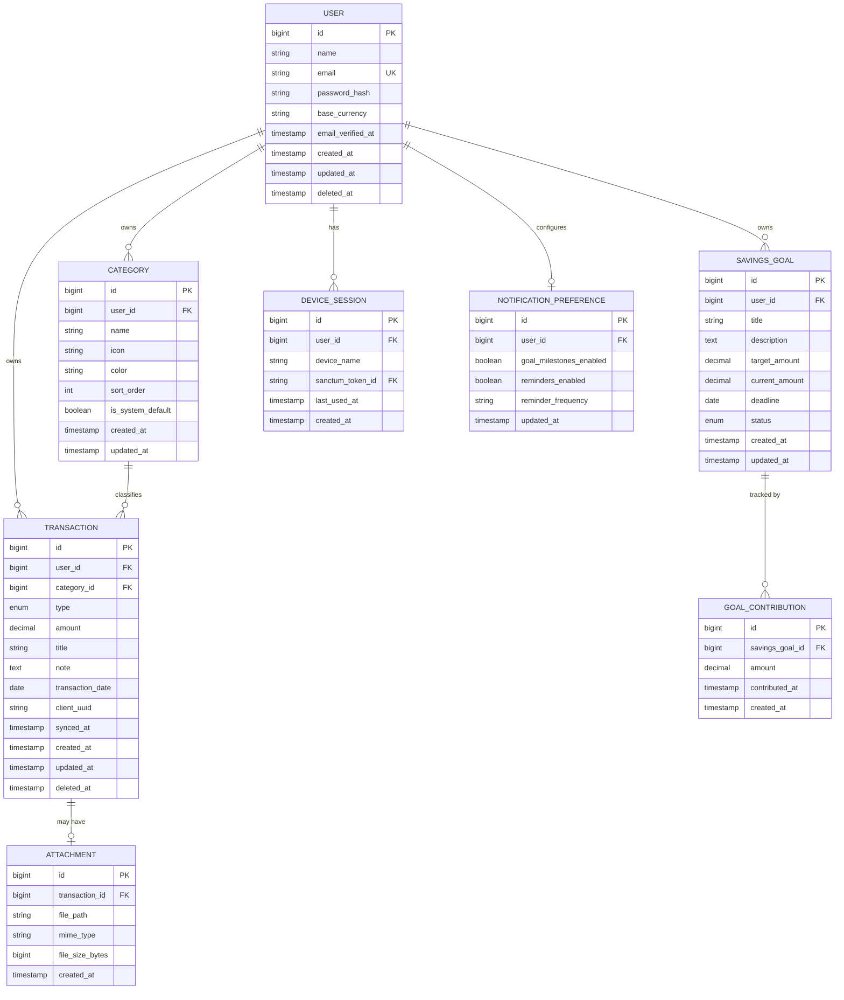

### 23.2 Data Dictionary

**Entity: User** *(maps to FR-001–FR-005, FR-070, FR-073)*

| Field | Type | Required | Description | Constraints |
|---|---|---|---|---|
| id | bigint | Yes | Primary key | Auto-increment |
| name | varchar(255) | Yes | Display name | 1–255 chars |
| email | varchar(255) | Yes | Login email | Unique, valid email format |
| password_hash | varchar(255) | Yes | Bcrypt hash | Never returned in any API response |
| base_currency | varchar(3) | Yes | ISO 4217 currency code | Default set at onboarding; e.g. USD, IDR, EUR |
| email_verified_at | timestamp | No | Verification timestamp | Null until verified |
| created_at / updated_at | timestamp | Yes | Standard audit fields | — |
| deleted_at | timestamp | No | Soft-delete marker | Supports BR-005's 30-day grace period |

**Entity: Category** *(maps to FR-030–FR-032)*

| Field | Type | Required | Description | Constraints |
|---|---|---|---|---|
| id | bigint | Yes | Primary key | Auto-increment |
| user_id | bigint FK | Yes | Owning user | References users.id, cascade on user delete |
| name | varchar(100) | Yes | Category name | Unique per user_id (case-insensitive) |
| icon | varchar(50) | No | Icon identifier for UI | Design-system enum, not free text |
| color | varchar(7) | No | Hex color for UI | Format `#RRGGBB` |
| sort_order | int | Yes | Manual ordering position | Default assigned on creation |
| is_system_default | boolean | Yes | True only for the permanent "Uncategorized" bucket | Exactly one row per user has this true; not exposed as a "built-in vs custom" concept anywhere in the UI per BR-003 |
| created_at / updated_at | timestamp | Yes | Standard audit fields | — |

**Entity: Transaction** *(maps to FR-012–FR-014, FR-060–FR-061)*

| Field | Type | Required | Description | Constraints |
|---|---|---|---|---|
| id | bigint | Yes | Primary key | Auto-increment |
| user_id | bigint FK | Yes | Owning user | References users.id |
| category_id | bigint FK | Yes | Category | References categories.id; reassigned to Uncategorized on category delete (BR-002) |
| type | enum | Yes | `income` or `expense` | — |
| amount | decimal(15,2) | Yes | Transaction amount | Must be > 0 |
| title | varchar(255) | Yes | Transaction title | 1–255 chars |
| note | text | No | Optional free-text note | Max 1000 chars |
| transaction_date | date | Yes | Date of the transaction | Cannot be a future date (BR-006) |
| client_uuid | varchar(36) | Yes | Client-generated UUID | Used for offline-created records to enable idempotent sync (prevents duplicate creation on retry) |
| synced_at | timestamp | No | When this record was confirmed synced | Null while pending sync (supports FR-040) |
| created_at / updated_at | timestamp | Yes | Standard audit fields | — |
| deleted_at | timestamp | No | Soft-delete marker | — |

**Entity: Attachment** *(maps to FR-012)*

| Field | Type | Required | Description | Constraints |
|---|---|---|---|---|
| id | bigint | Yes | Primary key | Auto-increment |
| transaction_id | bigint FK | Yes | Owning transaction | References transactions.id, cascade on delete |
| file_path | varchar(500) | Yes | Storage path/key | Not publicly listable; served via signed, expiring URLs |
| mime_type | varchar(100) | Yes | File MIME type | Restricted to image/jpeg, image/png, application/pdf |
| file_size_bytes | bigint | Yes | File size | Max 5MB enforced server-side |
| created_at | timestamp | Yes | Upload timestamp | — |

**Entity: Savings Goal** *(maps to FR-020–FR-022)*

| Field | Type | Required | Description | Constraints |
|---|---|---|---|---|
| id | bigint | Yes | Primary key | Auto-increment |
| user_id | bigint FK | Yes | Owning user | References users.id |
| title | varchar(255) | Yes | Goal title | 1–255 chars |
| description | text | No | Optional description | Max 1000 chars |
| target_amount | decimal(15,2) | Yes | Goal target | Must be > 0 |
| current_amount | decimal(15,2) | Yes | Running total of contributions | Defaults to 0; denormalized sum of goal_contributions for read performance |
| deadline | date | No | Optional target date | Must be today or later if set (FR-020) |
| status | enum | Yes | `active`, `completed`, `abandoned` | Auto-set to `completed` when current_amount >= target_amount |
| created_at / updated_at | timestamp | Yes | Standard audit fields | — |

**Entity: Goal Contribution** *(maps to FR-021)*

| Field | Type | Required | Description | Constraints |
|---|---|---|---|---|
| id | bigint | Yes | Primary key | Auto-increment |
| savings_goal_id | bigint FK | Yes | Owning goal | References savings_goals.id, cascade on delete |
| amount | decimal(15,2) | Yes | Contribution amount | Must be > 0 |
| contributed_at | timestamp | Yes | When the contribution was logged | Defaults to creation time |
| created_at | timestamp | Yes | Audit field | — |

**Entity: Device Session** *(maps to FR-073)*

| Field | Type | Required | Description | Constraints |
|---|---|---|---|---|
| id | bigint | Yes | Primary key | Auto-increment |
| user_id | bigint FK | Yes | Owning user | References users.id |
| device_name | varchar(255) | Yes | Human-readable device label | e.g. "iPhone 15 - Jakarta" |
| sanctum_token_id | bigint FK | Yes | Reference to Sanctum's personal_access_tokens row | Revoking deletes the token row |
| last_used_at | timestamp | Yes | Last API call timestamp | Updated on each authenticated request (throttled to avoid write amplification) |
| created_at | timestamp | Yes | Session creation timestamp | — |

**Entity: Notification Preference** *(maps to FR-071)*

| Field | Type | Required | Description | Constraints |
|---|---|---|---|---|
| id | bigint | Yes | Primary key | Auto-increment |
| user_id | bigint FK | Yes | Owning user | One row per user (1:1) |
| goal_milestones_enabled | boolean | Yes | Toggle for goal-completion notifications | Default true |
| reminders_enabled | boolean | Yes | Toggle for logging reminders | Default false |
| reminder_frequency | varchar(20) | No | `daily` or `weekly` | Only relevant if reminders_enabled |
| updated_at | timestamp | Yes | Last change timestamp | — |

---

## 24. System Architecture

### 24.1 C4 Context Diagram

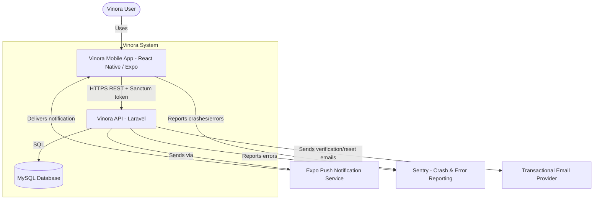

### 24.2 C4 Container Diagram

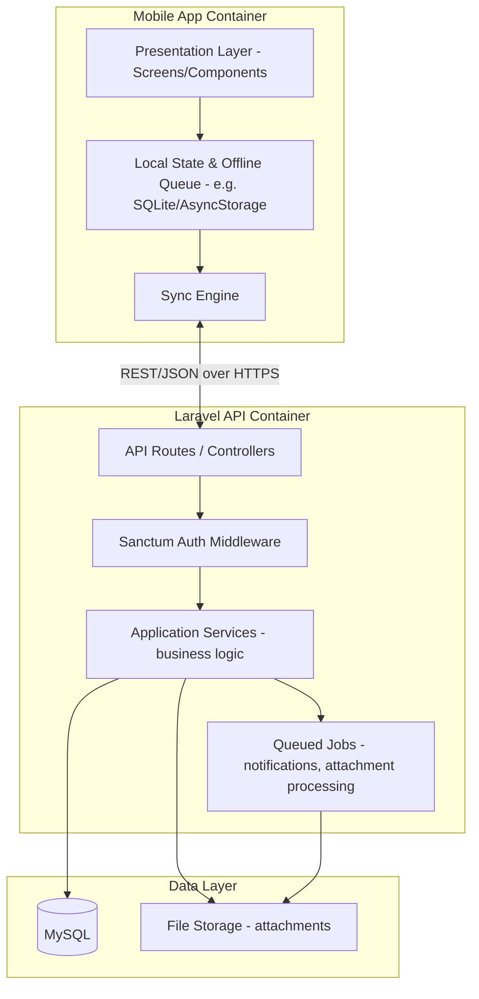

### 24.3 Deployment Architecture

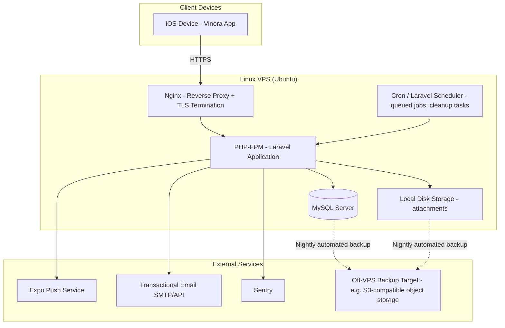

**Architecture notes:**
- The API is deliberately a single deployable Laravel monolith rather than microservices — appropriate for the confirmed 2–5 person team and few-month timeline (NFR-003, NFR-008). Splitting into services is a future consideration only if scale (NFR-006) is meaningfully exceeded.
- The VPS choice is intentionally cloud-agnostic (plain Ubuntu + Nginx + PHP-FPM + MySQL, no provider-proprietary services) so migration to DigitalOcean, Hetzner, AWS, or GCP requires no architectural rework — only re-provisioning the same stack on the new host.
- Attachment storage starts on local disk (matches the "future-ready, implementation optional" note in the brief for attachments) with a documented, low-effort migration path to S3-compatible object storage if attachment volume grows enough to warrant it.
- No message queue broker (e.g., Redis/RabbitMQ) is introduced in V1; Laravel's database-backed queue driver is sufficient at the confirmed scale (NFR-006) and avoids an extra infrastructure component the team would need to operate.

---

## 25. API Specification

All endpoints are prefixed `/api/v1`. All authenticated endpoints require an `Authorization: Bearer {sanctum_token}` header. All responses are JSON. Standard error shape: `{ "message": string, "errors": { field: [messages] } }` for validation (422), and `{ "message": string }` for other error statuses.

### 25.1 Authentication

**API-001** `POST /api/v1/auth/register`
- **Description:** Create a new account.
- **Headers:** None (public endpoint)
- **Request body:** `{ name, email, password, password_confirmation }`
- **Validation rules:** email unique/valid; password min 8 chars, 1 letter + 1 number, must match confirmation
- **Success response:** `201` `{ user: {...}, token: string }`
- **Error responses:** `422` validation errors; `429` rate-limited on repeated attempts
- **Permission required:** None
- **Rate limit:** 10 requests / hour / IP
- **Maps to feature:** FR-001

**API-002** `POST /api/v1/auth/login`
- **Description:** Authenticate and issue a device-scoped Sanctum token.
- **Headers:** None
- **Request body:** `{ email, password, device_name }`
- **Validation rules:** All fields required
- **Success response:** `200` `{ user: {...}, token: string }`
- **Error responses:** `401` invalid credentials (generic message, no enumeration); `429` rate-limited
- **Permission required:** None
- **Rate limit:** 5 requests / minute / IP, then exponential backoff
- **Maps to feature:** FR-003

**API-003** `POST /api/v1/auth/logout`
- **Description:** Revoke the current device's token.
- **Headers:** Authorization
- **Request body:** None
- **Success response:** `204`
- **Error responses:** `401` unauthenticated
- **Permission required:** Authenticated (self)
- **Rate limit:** Standard authenticated tier
- **Maps to feature:** FR-003

**API-004** `POST /api/v1/auth/password/forgot`
- **Description:** Request a password reset email.
- **Request body:** `{ email }`
- **Success response:** `200` generic "if that email exists, a reset link was sent" (prevents enumeration)
- **Error responses:** `422` invalid email format; `403` if account unverified (per FR-004)
- **Permission required:** None
- **Rate limit:** 5 requests / hour / email
- **Maps to feature:** FR-004

**API-005** `POST /api/v1/auth/password/reset`
- **Description:** Complete a password reset using the emailed token.
- **Request body:** `{ token, email, password, password_confirmation }`
- **Success response:** `200`
- **Error responses:** `422` expired/invalid token or validation failure
- **Permission required:** None (token acts as auth)
- **Maps to feature:** FR-004

**API-006** `POST /api/v1/auth/email/verify/{id}/{hash}`
- **Description:** Confirm email verification link.
- **Success response:** `200`
- **Error responses:** `410` expired link
- **Permission required:** Authenticated (self, via signed URL)
- **Maps to feature:** FR-002

### 25.2 Profile & Account

**API-010** `GET /api/v1/me`
- **Description:** Fetch the authenticated user's profile.
- **Success response:** `200` `{ id, name, email, base_currency, email_verified_at }`
- **Error responses:** `401`
- **Permission required:** Authenticated (self)
- **Maps to feature:** FR-005

**API-011** `PATCH /api/v1/me`
- **Description:** Update profile fields (name, email — email triggers re-verification).
- **Request body:** `{ name?, email? }`
- **Success response:** `200` updated user object
- **Error responses:** `422` validation (e.g., email already taken)
- **Permission required:** Authenticated (self)
- **Maps to feature:** FR-005

**API-012** `PATCH /api/v1/me/currency`
- **Description:** Change base currency (future transactions only).
- **Request body:** `{ base_currency }`
- **Success response:** `200`
- **Error responses:** `422` invalid ISO 4217 code
- **Permission required:** Authenticated (self)
- **Maps to feature:** FR-070

**API-013** `PATCH /api/v1/me/password`
- **Description:** Change password; revokes all other sessions.
- **Request body:** `{ current_password, password, password_confirmation }`
- **Success response:** `200`
- **Error responses:** `422` current password incorrect or new password invalid
- **Permission required:** Authenticated (self)
- **Maps to feature:** FR-073

**API-014** `GET /api/v1/me/sessions`
- **Description:** List active device sessions.
- **Success response:** `200` `[{ id, device_name, last_used_at, is_current }]`
- **Permission required:** Authenticated (self)
- **Maps to feature:** FR-073

**API-015** `DELETE /api/v1/me/sessions/{id}`
- **Description:** Revoke a specific session.
- **Success response:** `204`
- **Error responses:** `404` if not owned by requester
- **Permission required:** Authenticated (self)
- **Maps to feature:** FR-073

### 25.3 Categories

**API-020** `GET /api/v1/categories`
- **Description:** List all categories for the authenticated user, ordered by sort_order.
- **Success response:** `200` `[{ id, name, icon, color, sort_order, is_system_default }]`
- **Permission required:** Authenticated (self)
- **Maps to feature:** FR-030–FR-032

**API-021** `POST /api/v1/categories`
- **Description:** Create a category.
- **Request body:** `{ name, icon?, color? }`
- **Validation rules:** name required, unique per user (case-insensitive)
- **Success response:** `201` category object
- **Error responses:** `422` duplicate name
- **Permission required:** Authenticated (self)
- **Maps to feature:** FR-030

**API-022** `PATCH /api/v1/categories/{id}`
- **Description:** Rename or restyle a category.
- **Request body:** `{ name?, icon?, color? }`
- **Success response:** `200` updated category
- **Error responses:** `404` not owned; `422` duplicate name; `403` attempting to modify is_system_default's protected fields
- **Permission required:** Authenticated (self, ownership enforced)
- **Maps to feature:** FR-032

**API-023** `DELETE /api/v1/categories/{id}`
- **Description:** Delete a category; requires reassignment target if transactions exist.
- **Request body:** `{ reassign_to_category_id? }` (required if category has transactions; defaults to Uncategorized if omitted)
- **Success response:** `204`
- **Error responses:** `404` not owned; `409` has transactions and no valid reassignment target provided; `403` attempting to delete the system Uncategorized bucket
- **Permission required:** Authenticated (self)
- **Maps to feature:** FR-032

**API-024** `PATCH /api/v1/categories/reorder`
- **Description:** Bulk-update sort order.
- **Request body:** `{ ordered_ids: [id, id, ...] }`
- **Success response:** `200`
- **Permission required:** Authenticated (self)
- **Maps to feature:** FR-032

### 25.4 Transactions

**API-030** `GET /api/v1/transactions`
- **Description:** List transactions with search/filter/pagination.
- **Request body / params:** query params `search`, `category_id`, `type`, `date_from`, `date_to`, `page`, `per_page` (default 25, max 100)
- **Success response:** `200` `{ data: [...transactions], meta: { current_page, total, ... } }`
- **Permission required:** Authenticated (self)
- **Maps to feature:** FR-012, FR-060, FR-061

**API-031** `POST /api/v1/transactions`
- **Description:** Create a transaction. Idempotent by `client_uuid` to safely support offline-sync retries.
- **Request body:** `{ client_uuid, type, amount, title, category_id, note?, transaction_date }`
- **Validation rules:** amount > 0; transaction_date not in the future; category_id must belong to requester
- **Success response:** `201` transaction object with `synced_at` set
- **Error responses:** `422` validation; `200` (not `201`) if `client_uuid` already exists — returns the existing record unchanged, preventing duplicate creation on sync retry
- **Permission required:** Authenticated (self)
- **Maps to feature:** FR-012, FR-040

**API-032** `GET /api/v1/transactions/{id}`
- **Description:** Fetch a single transaction.
- **Success response:** `200`
- **Error responses:** `404` not owned
- **Permission required:** Authenticated (self)
- **Maps to feature:** FR-012

**API-033** `PATCH /api/v1/transactions/{id}`
- **Description:** Edit a transaction.
- **Request body:** any subset of `{ type, amount, title, category_id, note, transaction_date }`
- **Success response:** `200` updated transaction; server sets `updated_at` used as sync-conflict authority (FR-042)
- **Error responses:** `404`; `409` if server copy was modified more recently than the client's known version (conflict, handled per FR-042)
- **Permission required:** Authenticated (self)
- **Maps to feature:** FR-013

**API-034** `DELETE /api/v1/transactions/{id}`
- **Description:** Soft-delete a transaction.
- **Success response:** `204`
- **Error responses:** `404`
- **Permission required:** Authenticated (self)
- **Maps to feature:** FR-014

**API-035** `POST /api/v1/transactions/{id}/attachment`
- **Description:** Upload an attachment for a transaction.
- **Request body:** multipart/form-data, `file`
- **Validation rules:** max 5MB; mime type in `image/jpeg, image/png, application/pdf`
- **Success response:** `201` attachment object
- **Error responses:** `422` invalid file; `413` too large
- **Permission required:** Authenticated (self, must own the transaction)
- **Maps to feature:** FR-012

**API-036** `POST /api/v1/transactions/sync`
- **Description:** Bulk-sync endpoint for the offline queue — accepts an array of queued local operations and processes them atomically per-item (one item's failure doesn't block others).
- **Request body:** `{ operations: [{ op: "create"|"update"|"delete", client_uuid, payload, client_updated_at }] }`
- **Success response:** `200` `{ results: [{ client_uuid, status: "synced"|"conflict"|"error", server_record?, conflict_reason? }] }`
- **Permission required:** Authenticated (self)
- **Rate limit:** 1 request / 10 seconds / device (batches, not per-item, to avoid abuse)
- **Maps to feature:** FR-040, FR-042

### 25.5 Savings Goals

**API-040** `GET /api/v1/goals`
- **Description:** List savings goals for the authenticated user.
- **Success response:** `200` `[{ id, title, target_amount, current_amount, deadline, status }]`
- **Permission required:** Authenticated (self)
- **Maps to feature:** FR-020

**API-041** `POST /api/v1/goals`
- **Description:** Create a savings goal.
- **Request body:** `{ title, target_amount, deadline?, description? }`
- **Validation rules:** target_amount > 0; deadline (if set) must be today or later
- **Success response:** `201`
- **Error responses:** `422`
- **Permission required:** Authenticated (self)
- **Maps to feature:** FR-020

**API-042** `PATCH /api/v1/goals/{id}`
- **Description:** Edit a goal.
- **Request body:** any subset of `{ title, target_amount, deadline, description }`
- **Success response:** `200`
- **Error responses:** `404`
- **Permission required:** Authenticated (self)
- **Maps to feature:** FR-022

**API-043** `DELETE /api/v1/goals/{id}`
- **Description:** Delete a goal and its contribution history.
- **Success response:** `204`
- **Error responses:** `404`
- **Permission required:** Authenticated (self)
- **Maps to feature:** FR-022

**API-044** `POST /api/v1/goals/{id}/contributions`
- **Description:** Log a contribution toward a goal.
- **Request body:** `{ amount, contributed_at? }`
- **Validation rules:** amount > 0
- **Success response:** `201` `{ contribution, goal: { current_amount, status } }` — triggers goal-milestone push notification if status becomes `completed` and notifications are enabled (FR-071)
- **Error responses:** `422`; `404`
- **Permission required:** Authenticated (self)
- **Maps to feature:** FR-021

### 25.6 Reports

**API-050** `GET /api/v1/reports/summary`
- **Description:** Monthly summary (income, expense, net).
- **Request body / params:** `month` (YYYY-MM)
- **Success response:** `200` `{ income_total, expense_total, net }`
- **Permission required:** Authenticated (self)
- **Maps to feature:** FR-050

**API-051** `GET /api/v1/reports/category-distribution`
- **Description:** Category breakdown for a period.
- **Request body / params:** `date_from`, `date_to`, `type` (income/expense)
- **Success response:** `200` `[{ category_id, category_name, total, percentage }]`
- **Permission required:** Authenticated (self)
- **Maps to feature:** FR-051

**API-052** `GET /api/v1/reports/income-vs-expense`
- **Description:** Period-over-period income/expense comparison.
- **Request body / params:** `date_from`, `date_to`, `granularity` (month)
- **Success response:** `200` `[{ period, income_total, expense_total }]`
- **Permission required:** Authenticated (self)
- **Maps to feature:** FR-052

**API-053** `GET /api/v1/reports/spending-trend`
- **Description:** Trend of spending over up to the last 6 months.
- **Request body / params:** `months` (default 6, max 12)
- **Success response:** `200` `[{ month, total_expense }]`
- **Permission required:** Authenticated (self)
- **Maps to feature:** FR-053

### 25.7 Notification Preferences

**API-060** `GET /api/v1/me/notifications`
- **Description:** Get notification preferences.
- **Success response:** `200` `{ goal_milestones_enabled, reminders_enabled, reminder_frequency }`
- **Permission required:** Authenticated (self)
- **Maps to feature:** FR-071

**API-061** `PATCH /api/v1/me/notifications`
- **Description:** Update notification preferences.
- **Request body:** any subset of the fields above
- **Success response:** `200`
- **Permission required:** Authenticated (self)
- **Maps to feature:** FR-071

---

## 26. Behavioral Diagrams

### 26.1 Use Case Diagram

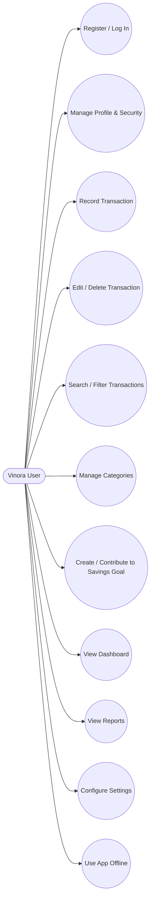

*(Single actor by design — see Section 22, Permission Matrix. There is no admin/internal actor within the product itself.)*

### 26.2 Activity Diagram(s)

Activity diagrams for the core flows (onboarding, transaction creation, savings goal contribution, category management, report review) are documented as flowcharts in Section 14 (User Flows), each explicitly annotated with the requirement IDs they implement, so they are not duplicated here.

### 26.3 Sequence Diagram(s)

**Transaction creation while online** *(maps to API-031, FR-012)*

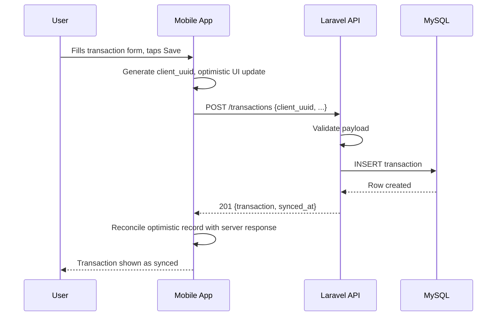

**Offline sync on reconnect** *(maps to API-036, FR-040, FR-042)*

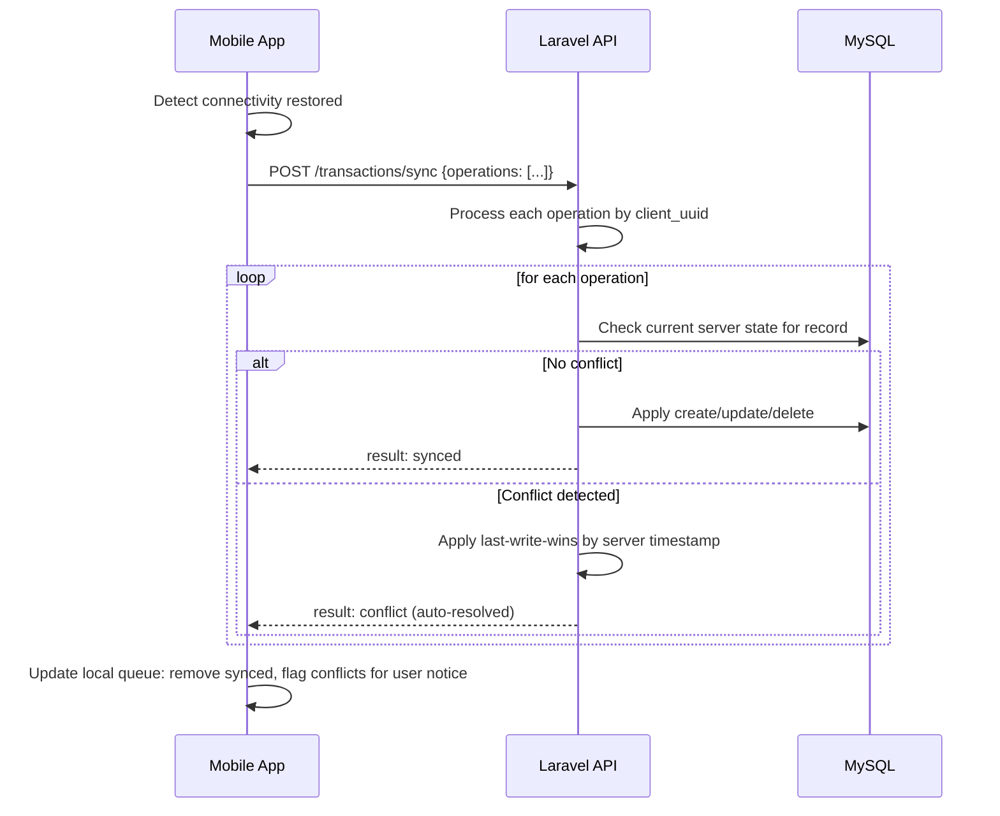

### 26.4 State Diagram(s)

**Transaction lifecycle** *(maps to FR-012–FR-014, FR-040)*

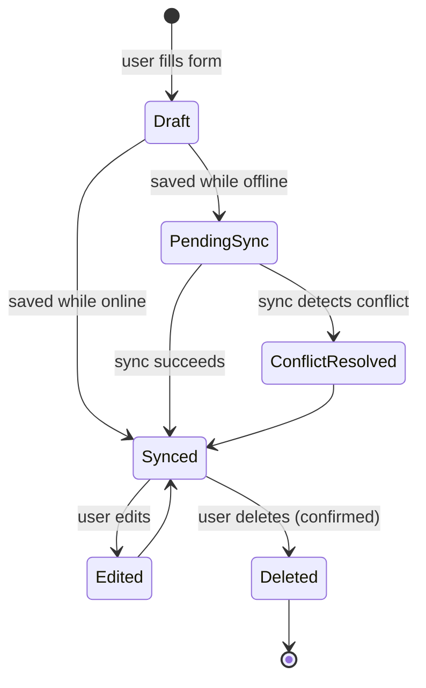

**Savings goal lifecycle** *(maps to FR-020–FR-022)*

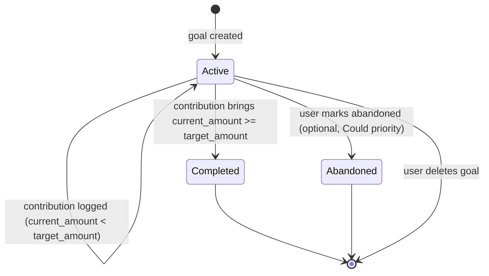

---

## 27. Security Considerations

**Authentication & Authorization**
- Laravel Sanctum issues per-device, revocable API tokens (see API-002, API-003, FR-073); no long-lived shared secrets are used.
- Every data-access endpoint scopes queries to the authenticated user's own records (Section 22); there is no cross-user data path in the API by construction, not by client-side convention alone.
- Password reset and email-change flows use signed, time-limited tokens (1 hour for reset, 24 hours for verification) rather than reusable credentials.

**Data Protection**
- TLS 1.2+ enforced for all traffic; HTTP requests are redirected to HTTPS at the Nginx layer (NFR-004).
- Passwords are hashed with bcrypt; the hash is never included in any API response or log line.
- Financial amounts and transaction notes are excluded from application logs and from third-party crash-reporting payloads (Sentry) via explicit scrubbing rules, since they are personal financial data even though no formal regulatory regime (e.g., PCI-DSS) applies to Vinora's scope.
- Attachments are served via short-lived signed URLs rather than public static paths, preventing enumeration of another user's uploaded files even if a path were guessed.

**Threat Model (lightweight, per major flow)**

| Flow | Potential threat | Mitigation |
|---|---|---|
| Login | Brute-force credential guessing | Rate limiting (API-002: 5/min/IP with backoff) |
| Registration | Account enumeration via error message differences | Generic error messages on both login and password-reset endpoints |
| Transaction sync | Duplicate transaction creation via retried offline sync | Idempotency via client_uuid (API-031, API-036) |
| Session management | Stolen/leaked device token | Per-device token scoping + user-visible session list with individual revocation (FR-073) |
| Attachment upload | Malicious file upload (e.g., disguised executable) | MIME-type allowlist + size cap enforced server-side, never trusting client-reported type alone |
| API abuse | Scraping or automated abuse of report/list endpoints | Standard per-user, per-endpoint rate limiting on all authenticated routes |

**Audit Logging**
- Security-relevant events (login, logout, password change, session revocation, account deletion request) are logged with timestamp, user ID, and device/IP metadata — but never with financial data — retained for 90 days for incident investigation.

**Compliance**
- No named regulatory regime (GDPR/HIPAA/PCI-DSS/SOC 2) is in scope per discovery, since Vinora is not a bank, payment processor, healthcare, or enterprise product. The data-protection practices above are treated as an unconditional baseline regardless of formal compliance obligation, consistent with the brief's trust-first brand positioning.

---

## 28. Logging & Monitoring Strategy

- **Application logs:** Laravel's structured logging (JSON format) captures request-level errors, queued job failures, and sync-conflict events, written locally and rotated daily (14-day retention on-disk, matching the small-VPS deployment).
- **Error tracking:** Sentry captures unhandled exceptions from both the Laravel API and the React Native app, with financial-data scrubbing rules applied before transmission (Section 27).
- **Uptime monitoring:** A lightweight external uptime check (e.g., a simple HTTP health-check ping service) polls a dedicated `/api/v1/health` endpoint every 60 seconds, alerting the team via email/Slack on failure, appropriate for the confirmed single-VPS deployment and small-team operational capacity.
- **Health endpoint:** `GET /api/v1/health` returns `200 {status: "ok", db: "ok"}` and checks DB connectivity, used both by the uptime monitor and by deployment scripts to confirm a successful release.
- **Backup monitoring:** Nightly MySQL and attachment-storage backups (Section 24.3) log success/failure; a failed backup triggers an alert rather than failing silently.
- **What is explicitly not built for V1:** No centralized log aggregation platform (e.g., ELK/Datadog) or distributed tracing — proportionate to the confirmed team size and single-monolith deployment; revisit if the team or infrastructure grows (see Future Enhancements).

## 29. Performance & Scalability Requirements

Fully specified in Section 17 (NFR-001, NFR-003, NFR-006). Summarized here for reviewer convenience:

- p95 transaction save round-trip: ≤ 1.5s; dashboard load with cache: ≤ 500ms; report generation: ≤ 2s at up to 10,000 transactions per user.
- Sized for up to ~10,000 registered users / ~1,000 DAU at launch, with a documented (not required-for-V1) path to horizontal scaling if exceeded.

## 30. Accessibility & Localization

**Accessibility** — fully specified in NFR-005: WCAG 2.1 AA target, 4.5:1 minimum contrast, 44×44pt minimum touch targets, no color-only meaning encoding, full VoiceOver navigability.

**Localization** — V1 ships English-only per the confirmed assumption in Section 9. To avoid this becoming a costly retrofit, the following low-cost groundwork is required now even though translation itself is out of scope for V1:
- All user-facing strings are extracted into a single string-resource layer (not hardcoded inline in components), so a future translation pass does not require touching business logic or component code.
- Date, number, and currency formatting use locale-aware formatting utilities (not manual string concatenation) from day one, since currency display already varies per user's base currency (FR-070) even without multi-language support.
- No layout assumes English-length text will always fit (avoid fixed-width text containers that would break under longer translated strings later).

## 31. QA Strategy

### 31.1 Test Cases

A representative sample is provided below; the full test suite extends this pattern to every acceptance criterion in Section 16.

**TC-001** — Successful account registration
- **Preconditions:** No existing account with the test email
- **Steps:** Submit registration form with valid name, unused email, valid password + confirmation
- **Expected result:** Account created, user authenticated, redirected to currency selection
- **Type:** Positive
- **Maps to requirement:** FR-001

**TC-002** — Registration rejected for duplicate email
- **Preconditions:** An account already exists with the test email
- **Steps:** Submit registration with that email
- **Expected result:** Generic error shown; no account enumeration signal; no duplicate account created
- **Type:** Negative
- **Maps to requirement:** FR-001

**TC-003** — Transaction amount boundary validation
- **Preconditions:** Authenticated user, at least one category exists
- **Steps:** Attempt to save a transaction with amount = 0, then amount = -5
- **Expected result:** Both rejected with inline validation; no transaction created
- **Type:** Boundary
- **Maps to requirement:** FR-012

**TC-004** — Offline transaction creation and sync
- **Preconditions:** Authenticated user, device in airplane mode
- **Steps:** Create a transaction offline; verify local "pending sync" indicator; disable airplane mode; wait for background sync
- **Expected result:** Transaction appears immediately with pending indicator; syncs automatically within 30s of reconnect; indicator clears; no duplicate created on server
- **Type:** Positive
- **Maps to requirement:** FR-040, NFR-007

**TC-005** — Category deletion requires reassignment
- **Preconditions:** A category exists with at least one transaction assigned
- **Steps:** Attempt to delete the category without specifying a reassignment target
- **Expected result:** API returns 409; category is not deleted; user is prompted to choose a reassignment target
- **Type:** Negative
- **Maps to requirement:** FR-032, BR-002

**TC-006** — Savings goal auto-completes at target
- **Preconditions:** An active goal with target_amount = 1,000,000 and current_amount = 950,000
- **Steps:** Log a contribution of 50,000
- **Expected result:** Goal status becomes `completed`; completion state shown; milestone notification sent if enabled
- **Type:** Boundary
- **Maps to requirement:** FR-021

**TC-007** — Sync conflict resolved by last-write-wins
- **Preconditions:** A transaction edited on Device A while offline, and separately edited on Device B while online (Device A still offline)
- **Steps:** Bring Device A back online, trigger sync
- **Expected result:** The later server-timestamped edit wins; Device A shows a non-blocking auto-resolution notice
- **Type:** Negative/edge
- **Maps to requirement:** FR-042

**TC-008** — Password change revokes other sessions
- **Preconditions:** User is logged in on two devices
- **Steps:** Change password on Device A
- **Expected result:** Device B's token is invalidated on its next request; Device A remains logged in
- **Type:** Positive
- **Maps to requirement:** FR-073, BR-007

**TC-009** — Base currency change does not convert past transactions
- **Preconditions:** User has existing transactions recorded in USD
- **Steps:** Change base currency to IDR
- **Expected result:** Warning shown before confirming; past transaction amounts remain numerically unchanged, now displayed with the IDR symbol/format; new transactions use IDR
- **Type:** Positive
- **Maps to requirement:** FR-070, BR-001

**TC-010** — Search and filter combine with AND logic
- **Preconditions:** Multiple transactions across categories and dates exist
- **Steps:** Enter a search term and apply a category filter and a date range simultaneously
- **Expected result:** Only transactions matching all three conditions are returned
- **Type:** Positive
- **Maps to requirement:** FR-060, FR-061

### 31.2 Regression Scope

Any change touching the following areas requires a full regression pass across the listed dependent features, given their high fan-out in the data model and UX:
- **Category model changes** → regression across Transaction creation/edit, Reports (category distribution), Search/Filter, Dashboard recent transactions.
- **Transaction model/API changes** → regression across Dashboard, all four Reports, Search/Filter, Offline sync.
- **Auth/session changes** → regression across every authenticated endpoint and the offline-queue's token-refresh behavior.
- **Currency/base_currency changes** → regression across Dashboard, Transaction entry/display, Reports, Settings.

### 31.3 UAT Checklist

- [ ] A brand-new user can sign up, select a currency, accept or customize starter categories, and log a first transaction in under 2 minutes without external help.
- [ ] The dashboard accurately reflects balance/income/expense after several transactions of both types.
- [ ] A category can be renamed and the new name appears everywhere it's referenced (transactions, filters, reports) without a stale cache.
- [ ] Deleting a category with transactions correctly prompts reassignment and does not orphan any transaction.
- [ ] A savings goal can be created, contributed to across multiple sessions, and correctly shows completion at 100%.
- [ ] All four report types render correctly for a user with at least 2 months of varied transaction history.
- [ ] Search and filters return correct, combined results and a clear empty state when nothing matches.
- [ ] Creating a transaction in airplane mode, then reconnecting, results in a correctly synced record with no duplicates.
- [ ] Changing base currency shows the required warning and does not alter historical amounts.
- [ ] Password change correctly revokes other active sessions.
- [ ] The app is fully operable via VoiceOver for the core flows (add transaction, view dashboard, view reports).
- [ ] Dark mode and light mode both render every screen without contrast or clipping issues.

---

## 32. Risk Register

| ID | Risk | Likelihood | Impact | Mitigation | Owner |
|---|---|---|---|---|---|
| RISK-001 | Offline sync conflict logic (last-write-wins) silently discards a user's intended edit | Medium | Medium | Ship clear, non-blocking auto-resolution notices (FR-042); monitor real-world conflict frequency post-launch; add manual-merge UI in a future phase if frequency warrants it | Mobile Engineering Lead |
| RISK-002 | Scope creep reintroducing an explicitly out-of-scope feature (e.g., a stakeholder requesting bank-linking or gamification mid-build) | Medium | High | Product Owner enforces Section 8.2 (Out of Scope) as a hard gate in backlog grooming; any such request requires a deliberate, documented product-direction change, not an ad-hoc addition | Product Owner |
| RISK-003 | Single-VPS deployment becomes a single point of failure | Low (at launch scale) | High (if it occurs) | Automated nightly backups to off-VPS storage (Section 24.3); documented vertical-scaling and migration path; uptime monitoring with alerting (Section 28) | DevOps |
| RISK-004 | Small team (2–5 people) and few-month timeline leads to cut corners on non-functional requirements (security, accessibility) under deadline pressure | Medium | High | NFR-004/NFR-005 are treated as Must-priority release gates in the quality-gate review, not nice-to-haves subject to timeline trimming | Product Owner + QA Lead |
| RISK-005 | Category deletion/reassignment logic has a data-integrity bug that orphans transactions | Low | High | BR-002 enforced at the database FK level (category_id required, Uncategorized as fallback) in addition to application logic; covered by TC-005 | Backend Engineering Lead |
| RISK-006 | Users misunderstand that savings-goal contributions don't move real funds (Vinora holds no money) | Medium | Low | Explicit "log a contribution" copy rather than "transfer" language (FR-021 notes); no design element implies fund custody | Product Designer |
| RISK-007 | App Store review rejects the app for insufficient functionality or unclear data-handling disclosures | Low | Medium | Clear privacy-policy disclosure of data handling ahead of submission; ensure app fully functions per Apple's minimum-functionality guidelines before submission | Product Owner |
| RISK-008 | Attachment storage on local VPS disk fills up faster than anticipated | Low | Medium | File size cap (5MB) and mime-type allowlist (Section 25.4); documented migration path to object storage if usage trends toward it (Section 24.3) | DevOps |

## 33. Release Plan & Roadmap

Given the confirmed 2–5 person team and few-month timeline, V1 is planned as three internal milestones rather than a single big-bang release, each independently testable:

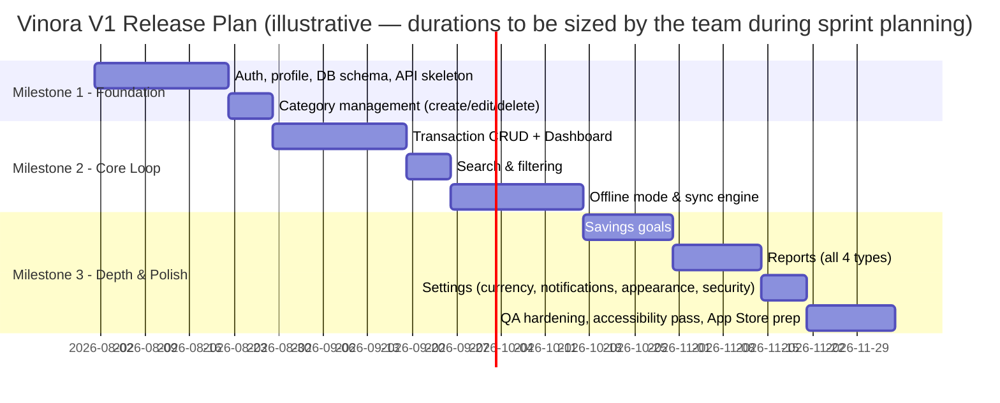

**Milestone 1 — Foundation:** Authentication, profile, database schema, API skeleton, category management. Exit criteria: a user can register, log in, and manage categories end-to-end.

**Milestone 2 — Core Loop:** Transaction CRUD, dashboard, search/filter, and — the highest-risk technical component — offline mode with sync. Exit criteria: the core daily-use loop (log a transaction, see the dashboard update, work offline) is fully functional and covers TC-003, TC-004, TC-010.

**Milestone 3 — Depth & Polish:** Savings goals, all four report types, settings, then a dedicated QA-hardening and accessibility pass before App Store submission. Exit criteria: full UAT checklist (Section 31.3) passes.

## 34. Future Enhancements

Explicitly deferred, not rejected — candidates for a post-V1 roadmap once real usage data exists:

- **Android release** — the architecture (API, data model) is Android-ready from day one per the confirmed platform decision; this is a client-development effort, not a backend rework.
- **Manual conflict-resolution UI** — if RISK-001 proves more frequent in practice than anticipated, replace last-write-wins with a user-facing merge screen for genuinely conflicting edits.
- **Recurring/scheduled transactions** — not requested in the brief and intentionally excluded from V1 (BR-006 restricts transactions to past/present dates only); a natural next-phase convenience feature if user demand emerges.
- **Multi-language localization** — groundwork laid in Section 30; actual translation work deferred until a market need is confirmed.
- **Object storage migration for attachments** — documented in Section 24.3 as a low-effort future step if local-disk usage trends warrant it.
- **Budgeting/spending limits per category** — adjacent to, but deliberately not part of, V1's "reports explain what happened" scope; would need its own discovery pass to avoid drifting into the "budgeting tool for businesses" territory the brief explicitly excludes for personal-use budgeting depth beyond reporting.

Anything not listed here and not in Section 8.1 remains covered by the brief's Out of Scope list (Section 8.2) and requires a deliberate future product-direction decision before being considered at all — most notably banking integration, investment tracking, multi-user accounts, and any gamification or AI-assistant feature, all of which are permanent exclusions per the brief's brand and product philosophy, not backlog items.

## 35. Glossary

| Term | Definition |
|---|---|
| Base Currency | The single currency (ISO 4217 code) a user selects for all their financial records; changeable, but not retroactively applied (BR-001) |
| Category | A user-defined (or onboarding-suggested, thereafter identical) label used to organize transactions; no permanent built-in/custom distinction (BR-003) |
| Client UUID | A UUID generated on-device when a transaction is created, used to make offline-sync retries idempotent (prevents duplicate records) |
| Contribution | A logged amount added toward a savings goal's progress; does not move or custody real funds (BR-004) |
| Last-write-wins | The conflict-resolution strategy where, when the same record was edited both offline and server-side, the edit with the later server-assigned timestamp is kept (FR-042) |
| Sanctum Token | A Laravel Sanctum-issued, per-device API authentication token; individually revocable without affecting other sessions |
| Uncategorized | The single permanent, non-deletable category bucket that a transaction falls into if its original category is deleted without reassignment (BR-002) |
| V1 | The first public release of Vinora, as scoped by this PRD |

## 36. Appendix

**Referenced source documents:**
- Vinora Product Brief (source input for this PRD)
- Design reference material reviewed for visual-language inspiration only (photography-first restraint, single-accent-color discipline, generous whitespace, editorial typography) — Vinora's own brand identity (hexagon logo; Primary #3E7CB1, Secondary #B1683E, Accent #5FAF7A) remains the actual design system source of truth for implementation, per the confirmed discovery decision.

**Open items carried forward from discovery (not blocking V1, revisit if they become relevant):**
- Exact push-notification and crash-reporting providers are recommended defaults (Expo Push, Sentry) rather than confirmed vendor commitments — swap-compatible if the team has an existing preference.
- Post-launch usage data should be used to revisit the Section 5 success-metric targets and the Section 17 scale assumptions (NFR-006), both currently launch-window estimates rather than measured baselines.

---

*End of document.*
